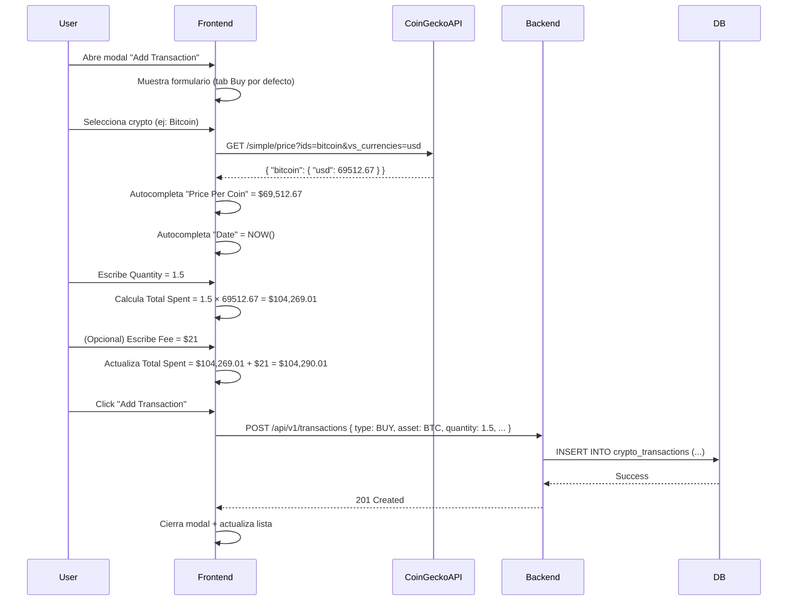

# Formulario "Add Transaction" — Portfolio Tracker

> **Especificación completa de UI/UX y backend para registro manual de transacciones cripto con autocompletado inteligente**
>
> Basado en el flujo de CoinMarketCap Portfolio Tracker

---

## 📋 Tabla de Contenidos

- [1. Análisis del flujo UX de CoinMarketCap](#1-análisis-del-flujo-ux-de-coinmarketcap)
- [2. Arquitectura del formulario](#2-arquitectura-del-formulario)
- [3. Autocompletado de precio en tiempo real](#3-autocompletado-de-precio-en-tiempo-real)
- [4. Tres tipos de transacción](#4-tres-tipos-de-transacción)
  - [4.1 Buy (Compra)](#41-buy-compra)
  - [4.2 Sell (Venta)](#42-sell-venta)
  - [4.3 Transfer (Transferencia)](#43-transfer-transferencia)
- [5. Selector de criptomonedas](#5-selector-de-criptomonedas)
- [6. Validación en tiempo real](#6-validación-en-tiempo-real)
- [7. Implementación backend](#7-implementación-backend)
- [8. Implementación frontend React](#8-implementación-frontend-react)
- [9. Estructura del Excel de Bitget](#9-estructura-del-excel-de-bitget)
- [10. Roadmap de implementación](#10-roadmap-de-implementación)

---

## 1. Análisis del flujo UX de CoinMarketCap

### ✅ Comportamiento observado en las capturas

**Flujo de interacción:**

1. **Usuario hace clic en "+ Add Transaction"**
   - Modal se abre con 3 tabs: `Buy` | `Sell` | `Transfer`
   - Por defecto muestra el tab **Buy**

2. **Usuario selecciona la criptomoneda** (ej: Bitcoin BTC)
   - Dropdown con búsqueda de todas las cryptos
   - Muestra icono + nombre + símbolo
   - Al seleccionar, el formulario se autocompleta:

3. **✨ AUTOCOMPLETADO AUTOMÁTICO** (sin que el usuario haga nada):
   - **Price Per Coin**: Se rellena automáticamente con el precio actual de mercado (ej: `$69,512.67`)
   - **Date**: Se rellena automáticamente con fecha/hora actual (ej: `Mar 11, 2026, 12:06 AM`)

4. **Usuario escribe la Quantity** (ej: `1.5`)
   - **Total Spent** se calcula automáticamente: `Quantity × Price Per Coin`
   - En el ejemplo: `1.5 × $69,512.67 = $104,269.01`

5. **Campos opcionales**:
   - **Fee**: El usuario puede agregar comisión
   - **Notes**: El usuario puede agregar notas

6. **Usuario hace clic en "Add Transaction"**
   - Se valida el formulario
   - Se guarda en la base de datos
   - El modal se cierra
   - La lista de transacciones se actualiza

---

### 🎯 Puntos clave del comportamiento

| Comportamiento | Descripción |
|----------------|-------------|
| **Autocompletado de precio** | Al seleccionar crypto, se consulta API (CoinGecko) y se rellena automáticamente |
| **Autocompletado de fecha** | Se usa la fecha/hora actual del navegador |
| **Cálculo automático de total** | `Total = Quantity × Price` (se actualiza en tiempo real cuando el usuario escribe) |
| **Validación reactiva** | El botón "Add Transaction" solo se habilita cuando los campos requeridos están llenos |
| **Precio editable** | El usuario PUEDE editar el precio si lo desea (útil para transacciones históricas) |

---

## 2. Arquitectura del formulario



---

## 3. Autocompletado de precio en tiempo real

### API de precios — CoinGecko

**Endpoint:** `GET https://api.coingecko.com/api/v3/simple/price`

**Ejemplo de request:**
```http
GET /api/v3/simple/price?ids=bitcoin,ethereum&vs_currencies=usd
```

**Ejemplo de response:**
```json
{
  "bitcoin": {
    "usd": 69512.67
  },
  "ethereum": {
    "usd": 3842.15
  }
}
```

---

### Implementación en Frontend (React)

```typescript
// hooks/useCryptoPrice.ts
import { useState, useEffect } from 'react';

export function useCryptoPrice(coinId: string | null) {
  const [price, setPrice] = useState<number | null>(null);
  const [loading, setLoading] = useState(false);

  useEffect(() => {
    if (!coinId) {
      setPrice(null);
      return;
    }

    const fetchPrice = async () => {
      setLoading(true);
      try {
        const response = await fetch(
          `https://api.coingecko.com/api/v3/simple/price?ids=${coinId}&vs_currencies=usd`
        );
        const data = await response.json();
        setPrice(data[coinId]?.usd || null);
      } catch (error) {
        console.error('Failed to fetch price:', error);
        setPrice(null);
      } finally {
        setLoading(false);
      }
    };

    fetchPrice();
  }, [coinId]);

  return { price, loading };
}
```

---

## 4. Tres tipos de transacción

### 4.1 Buy (Compra)

**Campos del formulario:**

| Campo | Tipo | Requerido | Autocompletado | Descripción |
|-------|------|-----------|----------------|-------------|
| **Coin** | Dropdown | ✅ Sí | No | Cripto que se compra (ej: Bitcoin) |
| **Quantity** | Number | ✅ Sí | No | Cantidad comprada (ej: 1.5 BTC) |
| **Price Per Coin** | Number | ✅ Sí | ✅ **Sí** (desde CoinGecko) | Precio unitario en USD |
| **Date** | DateTime | ✅ Sí | ✅ **Sí** (fecha actual) | Fecha/hora de la compra |
| **Fee** | Number | ❌ No | No | Comisión pagada (ej: $21) |
| **Notes** | Text | ❌ No | No | Notas opcionales |

**Campos calculados:**
- **Total Spent** = `Quantity × Price Per Coin + Fee`

---

### 4.2 Sell (Venta)

**Campos del formulario:**

| Campo | Tipo | Requerido | Autocompletado | Descripción |
|-------|------|-----------|----------------|-------------|
| **Coin** | Dropdown | ✅ Sí | No | Cripto que se vende |
| **Quantity** | Number | ✅ Sí | No | Cantidad vendida |
| **Price Per Coin** | Number | ✅ Sí | ✅ **Sí** (desde CoinGecko) | Precio de venta unitario |
| **Date** | DateTime | ✅ Sí | ✅ **Sí** (fecha actual) | Fecha/hora de la venta |
| **Fee** | Number | ❌ No | No | Comisión pagada |
| **Notes** | Text | ❌ No | No | Notas opcionales |

**Campos calculados:**
- **Total Received** = `Quantity × Price Per Coin - Fee`

---

### 4.3 Transfer (Transferencia)

**Escenarios:**
1. **Transfer In** (Depósito desde otro exchange o wallet)
2. **Transfer Out** (Retiro hacia otro exchange o wallet)

**Campos del formulario:**

| Campo | Tipo | Requerido | Autocompletado | Descripción |
|-------|------|-----------|----------------|-------------|
| **Transfer Type** | Radio | ✅ Sí | No | Transfer In / Transfer Out |
| **Coin** | Dropdown | ✅ Sí | No | Cripto transferida |
| **Quantity** | Number | ✅ Sí | No | Cantidad transferida |
| **Price Per Coin** | Number | ❌ No | ✅ **Sí** (solo referencia) | Precio en el momento del transfer |
| **Date** | DateTime | ✅ Sí | ✅ **Sí** (fecha actual) | Fecha/hora del transfer |
| **Fee** | Number | ❌ No | No | Comisión de red (gas fee) |
| **Notes** | Text | ❌ No | No | Notas (ej: "Deposit from Binance") |

**Campos calculados:**
- **Total Received** (Transfer In) = `Quantity` (el precio es solo referencia)
- **Total Sent** (Transfer Out) = `Quantity + Fee`

---

## 5. Selector de criptomonedas

### Lista de criptomonedas soportadas

El dropdown debe mostrar:
- **Icono** de la crypto
- **Nombre completo** (Bitcoin)
- **Símbolo** (BTC)

**Fuente de datos:** CoinGecko `/coins/list`

```json
[
  {
    "id": "bitcoin",
    "symbol": "btc",
    "name": "Bitcoin"
  },
  {
    "id": "ethereum",
    "symbol": "eth",
    "name": "Ethereum"
  },
  {
    "id": "tether",
    "symbol": "usdt",
    "name": "Tether"
  }
]
```

---

### Componente CryptoSelector

```tsx
// components/CryptoSelector.tsx
import { useState, useEffect } from 'react';

interface Crypto {
  id: string;
  symbol: string;
  name: string;
}

export function CryptoSelector({ 
  value, 
  onChange 
}: { 
  value: string | null; 
  onChange: (crypto: Crypto) => void;
}) {
  const [cryptos, setCryptos] = useState<Crypto[]>([]);
  const [search, setSearch] = useState('');
  const [isOpen, setIsOpen] = useState(false);

  useEffect(() => {
    // Fetch lista de cryptos (cachear en localStorage)
    const fetchCryptos = async () => {
      const cached = localStorage.getItem('cryptos-list');
      if (cached) {
        setCryptos(JSON.parse(cached));
        return;
      }

      const response = await fetch('https://api.coingecko.com/api/v3/coins/list');
      const data = await response.json();
      // Filtrar solo top 500 por relevancia
      const filtered = data.slice(0, 500);
      setCryptos(filtered);
      localStorage.setItem('cryptos-list', JSON.stringify(filtered));
    };

    fetchCryptos();
  }, []);

  const filtered = cryptos.filter(c => 
    c.name.toLowerCase().includes(search.toLowerCase()) ||
    c.symbol.toLowerCase().includes(search.toLowerCase())
  );

  return (
    <div className="crypto-selector">
      <button onClick={() => setIsOpen(true)}>
        {value || 'Select Coin'}
      </button>

      {isOpen && (
        <div className="dropdown">
          <input 
            type="text" 
            placeholder="Search" 
            value={search}
            onChange={(e) => setSearch(e.target.value)}
          />
          <div className="options">
            {filtered.slice(0, 20).map(crypto => (
              <div 
                key={crypto.id}
                onClick={() => {
                  onChange(crypto);
                  setIsOpen(false);
                }}
                className="option"
              >
                
                <span className="name">{crypto.name}</span>
                <span className="symbol">{crypto.symbol.toUpperCase()}</span>
              </div>
            ))}
          </div>
        </div>
      )}
    </div>
  );
}
```

---

## 6. Validación en tiempo real

### Reglas de validación

| Campo | Validación | Mensaje de error |
|-------|-----------|------------------|
| **Coin** | Requerido | "Please select a cryptocurrency" |
| **Quantity** | Requerido, > 0 | "Quantity must be greater than 0" |
| **Price Per Coin** | Requerido, > 0 | "Price must be greater than 0" |
| **Date** | Requerido, no futuro | "Date cannot be in the future" |
| **Fee** | Opcional, >= 0 | "Fee cannot be negative" |

---

### Estado del botón "Add Transaction"

```typescript
const isFormValid = () => {
  return (
    selectedCoin !== null &&
    quantity > 0 &&
    pricePerCoin > 0 &&
    date !== null &&
    date <= new Date() &&
    (fee === null || fee >= 0)
  );
};

// El botón solo se habilita cuando isFormValid() === true
<button 
  disabled={!isFormValid()}
  onClick={handleSubmit}
>
  Add Transaction
</button>
```

---

## 7. Implementación backend

### Endpoint: POST /api/v1/transactions

```java
@RestController
@RequestMapping("/api/v1/transactions")
public class TransactionController {

    private final TransactionService transactionService;

    @PostMapping
    public ResponseEntity<TransactionResponse> createTransaction(
            @Valid @RequestBody CreateTransactionRequest request,
            @AuthenticationPrincipal User user) {
        
        CryptoTransaction transaction = transactionService.create(request, user);
        
        return ResponseEntity
            .status(HttpStatus.CREATED)
            .body(TransactionResponse.from(transaction));
    }
}
```

---

### DTO: CreateTransactionRequest

```java
public record CreateTransactionRequest(
    
    @NotNull(message = "Transaction type is required")
    CryptoTransactionType type,  // BUY, SELL, TRANSFER_IN, TRANSFER_OUT
    
    @NotNull(message = "Portfolio ID is required")
    UUID portfolioId,
    
    @NotBlank(message = "Coin symbol is required")
    String coinSymbol,  // "BTC", "ETH", "USDT"
    
    @NotBlank(message = "Coin name is required")
    String coinName,    // "Bitcoin", "Ethereum"
    
    @NotBlank(message = "CoinGecko ID is required")
    String coinGeckoId, // "bitcoin", "ethereum"
    
    @NotNull(message = "Quantity is required")
    @DecimalMin(value = "0.0", inclusive = false, message = "Quantity must be greater than 0")
    BigDecimal quantity,
    
    @NotNull(message = "Price per coin is required")
    @DecimalMin(value = "0.0", inclusive = false, message = "Price must be greater than 0")
    BigDecimal pricePerCoin,
    
    @NotNull(message = "Executed date is required")
    @PastOrPresent(message = "Date cannot be in the future")
    OffsetDateTime executedAt,
    
    @DecimalMin(value = "0.0", message = "Fee cannot be negative")
    BigDecimal fee,
    
    String notes,
    
    String exchange  // "Binance", "Bybit", "Bitget", "Manual"
) {
    // Validación adicional
    public CreateTransactionRequest {
        if (fee == null) {
            fee = BigDecimal.ZERO;
        }
        if (exchange == null || exchange.isBlank()) {
            exchange = "Manual";
        }
    }
}
```

---

### Service: TransactionService

```java
@Service
@Transactional
public class TransactionService {

    private final CryptoTransactionRepository transactionRepo;
    private final PortfolioRepository portfolioRepo;

    public CryptoTransaction create(CreateTransactionRequest request, User user) {
        
        // Verificar que el portfolio pertenece al usuario
        Portfolio portfolio = portfolioRepo.findById(request.portfolioId())
            .orElseThrow(() -> new PortfolioNotFoundException(request.portfolioId()));
        
        if (!portfolio.getUser().getId().equals(user.getId())) {
            throw new AccessDeniedException("Portfolio does not belong to user");
        }

        // Crear transacción
        CryptoTransaction transaction = CryptoTransaction.builder()
            .portfolio(portfolio)
            .type(request.type())
            .baseAsset(request.coinSymbol())
            .quantity(request.quantity())
            .price(request.pricePerCoin())
            .feeAmount(request.fee())
            .feeAsset("USD")  // Asumimos fee en USD
            .executedAt(request.executedAt())
            .notes(request.notes())
            .exchange(request.exchange())
            .importSource("manual")
            .build();

        return transactionRepo.save(transaction);
    }
}
```

---

## 8. Implementación frontend React

### Componente completo: AddTransactionModal

```tsx
// components/AddTransactionModal.tsx
import { useState } from 'react';
import { useCryptoPrice } from '../hooks/useCryptoPrice';
import { CryptoSelector } from './CryptoSelector';

type TransactionType = 'BUY' | 'SELL' | 'TRANSFER_IN' | 'TRANSFER_OUT';

interface Crypto {
  id: string;
  symbol: string;
  name: string;
}

export function AddTransactionModal({ 
  isOpen, 
  onClose, 
  portfolioId 
}: { 
  isOpen: boolean; 
  onClose: () => void;
  portfolioId: string;
}) {
  const [type, setType] = useState<TransactionType>('BUY');
  const [selectedCoin, setSelectedCoin] = useState<Crypto | null>(null);
  const [quantity, setQuantity] = useState('');
  const [pricePerCoin, setPricePerCoin] = useState('');
  const [date, setDate] = useState(new Date().toISOString().slice(0, 16)); // YYYY-MM-DDTHH:mm
  const [fee, setFee] = useState('');
  const [notes, setNotes] = useState('');

  // ✨ AUTOCOMPLETADO: Obtener precio en tiempo real
  const { price, loading } = useCryptoPrice(selectedCoin?.id || null);

  // Actualizar precio cuando cambia la crypto seleccionada
  useEffect(() => {
    if (price !== null) {
      setPricePerCoin(price.toString());
    }
  }, [price]);

  // ✨ CÁLCULO AUTOMÁTICO: Total Spent / Total Received
  const total = useMemo(() => {
    const qty = parseFloat(quantity) || 0;
    const price = parseFloat(pricePerCoin) || 0;
    const feeAmount = parseFloat(fee) || 0;

    if (type === 'BUY') {
      return qty * price + feeAmount;
    } else if (type === 'SELL') {
      return qty * price - feeAmount;
    } else {
      return qty;  // Transfer: solo cantidad
    }
  }, [quantity, pricePerCoin, fee, type]);

  // Validación
  const isFormValid = () => {
    return (
      selectedCoin !== null &&
      parseFloat(quantity) > 0 &&
      parseFloat(pricePerCoin) > 0 &&
      date !== '' &&
      new Date(date) <= new Date()
    );
  };

  // Submit
  const handleSubmit = async () => {
    if (!isFormValid()) return;

    const payload = {
      type,
      portfolioId,
      coinSymbol: selectedCoin!.symbol.toUpperCase(),
      coinName: selectedCoin!.name,
      coinGeckoId: selectedCoin!.id,
      quantity: parseFloat(quantity),
      pricePerCoin: parseFloat(pricePerCoin),
      executedAt: new Date(date).toISOString(),
      fee: fee ? parseFloat(fee) : 0,
      notes: notes || null,
      exchange: 'Manual'
    };

    try {
      const response = await fetch('/api/v1/transactions', {
        method: 'POST',
        headers: { 
          'Content-Type': 'application/json',
          'Authorization': `Bearer ${getAccessToken()}`
        },
        body: JSON.stringify(payload)
      });

      if (response.ok) {
        onClose();
        // Refrescar lista de transacciones
      } else {
        const error = await response.json();
        alert(error.message);
      }
    } catch (error) {
      console.error('Failed to create transaction:', error);
    }
  };

  if (!isOpen) return null;

  return (
    <div className="modal-overlay">
      <div className="modal">
        <div className="modal-header">
          <h2>Add Transaction</h2>
          <button onClick={onClose}>×</button>
        </div>

        {/* Tabs */}
        <div className="tabs">
          <button 
            className={type === 'BUY' ? 'active' : ''}
            onClick={() => setType('BUY')}
          >
            Buy
          </button>
          <button 
            className={type === 'SELL' ? 'active' : ''}
            onClick={() => setType('SELL')}
          >
            Sell
          </button>
          <button 
            className={type.startsWith('TRANSFER') ? 'active' : ''}
            onClick={() => setType('TRANSFER_IN')}
          >
            Transfer
          </button>
        </div>

        {/* Transfer Type (solo si tab Transfer está activo) */}
        {type.startsWith('TRANSFER') && (
          <div className="transfer-type">
            <label>
              <input 
                type="radio" 
                checked={type === 'TRANSFER_IN'}
                onChange={() => setType('TRANSFER_IN')}
              />
              Transfer In
            </label>
            <label>
              <input 
                type="radio" 
                checked={type === 'TRANSFER_OUT'}
                onChange={() => setType('TRANSFER_OUT')}
              />
              Transfer Out
            </label>
          </div>
        )}

        {/* Selector de crypto */}
        <CryptoSelector 
          value={selectedCoin?.name || null}
          onChange={setSelectedCoin}
        />

        {/* Quantity */}
        <div className="form-row">
          <label>Quantity</label>
          <input 
            type="number"
            step="0.00000001"
            value={quantity}
            onChange={(e) => setQuantity(e.target.value)}
            placeholder="0.00"
          />
        </div>

        {/* Price Per Coin (autocompleta cuando se selecciona crypto) */}
        <div className="form-row">
          <label>
            Price Per Coin
            {loading && <span className="loading"> (Loading...)</span>}
          </label>
          <input 
            type="number"
            step="0.01"
            value={pricePerCoin}
            onChange={(e) => setPricePerCoin(e.target.value)}
            placeholder="$ 0.00"
          />
        </div>

        {/* Date (autocompleta con fecha actual) */}
        <div className="form-row">
          <label>Date</label>
          <input 
            type="datetime-local"
            value={date}
            onChange={(e) => setDate(e.target.value)}
            max={new Date().toISOString().slice(0, 16)}
          />
        </div>

        {/* Fee (opcional) */}
        <div className="form-row">
          <label>Fee (optional)</label>
          <input 
            type="number"
            step="0.01"
            value={fee}
            onChange={(e) => setFee(e.target.value)}
            placeholder="$ 0.00"
          />
        </div>

        {/* Notes (opcional) */}
        <div className="form-row">
          <label>Notes (optional)</label>
          <textarea 
            value={notes}
            onChange={(e) => setNotes(e.target.value)}
            placeholder="Add a note..."
            rows={2}
          />
        </div>

        {/* Total calculado */}
        <div className="total">
          <span className="label">
            {type === 'BUY' ? 'Total Spent' : 
             type === 'SELL' ? 'Total Received' : 
             'Total'}
          </span>
          <span className="amount">$ {total.toLocaleString('en-US', { minimumFractionDigits: 2, maximumFractionDigits: 2 })}</span>
        </div>

        {/* Botón submit */}
        <button 
          className="btn-primary"
          disabled={!isFormValid()}
          onClick={handleSubmit}
        >
          Add Transaction
        </button>
      </div>
    </div>
  );
}
```

---

## 9. Estructura del Excel de Bitget

### Columnas del archivo exportado

Basado en el archivo `historial_de_transacciones_en_spot_2025-01-01_2025-05-26.xlsx`:

| Columna | Tipo | Ejemplo | Descripción |
|---------|------|---------|-------------|
| **order** | int64 | `1311030525339721733` | ID único de la orden en Bitget |
| **Date** | string | `2025-05-26 16:52:35` | Fecha y hora de la transacción |
| **Coin** | string | `BTC`, `USDT`, `ETH` | Símbolo de la criptomoneda |
| **Type** | string | `Buy`, `Sell` | Tipo de transacción |
| **Amount** | float64 | `0.008490`, `823.118748` | Cantidad de la crypto |
| **Fee** | float64 | `-0.311125`, `0.000000` | Comisión (negativa si se cobra) |
| **Available** | float64 | `8.338490` | Balance disponible DESPUÉS de la transacción |

---

### Mapeo a nuestro modelo

```python
# Ejemplo de mapeo desde Excel de Bitget a nuestro modelo
bitget_row = {
    'order': 1311030525339721733,
    'Date': '2025-05-26 16:52:35',
    'Coin': 'BTC',
    'Type': 'Buy',
    'Amount': 0.008490,
    'Fee': -0.000021,
    'Available': 8.338490
}

# Convertir a nuestro formato
transaction = {
    'type': 'BUY' if bitget_row['Type'] == 'Buy' else 'SELL',
    'coinSymbol': bitget_row['Coin'],
    'quantity': bitget_row['Amount'],
    'executedAt': datetime.strptime(bitget_row['Date'], '%Y-%m-%d %H:%M:%S'),
    'fee': abs(bitget_row['Fee']),  # Convertir a positivo
    'exchange': 'Bitget',
    'exchangeTradeId': str(bitget_row['order'])
}
```

---

## 10. Roadmap de implementación

### Fase 1: Backend (Semana 1)
- [ ] Crear entidad `CryptoTransaction` con todos los campos
- [ ] Crear `CreateTransactionRequest` DTO con validaciones
- [ ] Implementar `POST /api/v1/transactions` endpoint
- [ ] Implementar `TransactionService.create()`
- [ ] Testing con JUnit 5: crear transacción BUY/SELL/TRANSFER

### Fase 2: Frontend — Formulario básico (Semana 2)
- [ ] Componente `AddTransactionModal` con 3 tabs
- [ ] Componente `CryptoSelector` con dropdown
- [ ] Inputs de Quantity, Price, Date, Fee, Notes
- [ ] Validación básica de formulario
- [ ] Submit con `POST /api/v1/transactions`

### Fase 3: Autocompletado inteligente (Semana 3)
- [ ] Hook `useCryptoPrice` que consulta CoinGecko
- [ ] Autocompletar "Price Per Coin" al seleccionar crypto
- [ ] Autocompletar "Date" con fecha actual
- [ ] Cálculo automático de "Total Spent/Received"
- [ ] Loading indicator mientras se obtiene precio

### Fase 4: UX refinada (Semana 4)
- [ ] Estilos CSS matching CoinMarketCap
- [ ] Animaciones de modal (fade in/out)
- [ ] Toasts de success/error
- [ ] Actualización reactiva de la lista de transacciones
- [ ] Manejo de errores (API caída, red lenta, etc.)

### Fase 5: Testing E2E (Semana 5)
- [ ] Cypress: flujo completo de agregar transacción BUY
- [ ] Cypress: flujo completo de agregar transacción SELL
- [ ] Cypress: flujo completo de agregar TRANSFER
- [ ] Validación de campos requeridos
- [ ] Validación de fecha no futura

---

## 📚 Referencias

- [CoinGecko API Documentation](https://www.coingecko.com/en/api/documentation)
- [CoinMarketCap Portfolio Tracker](https://coinmarketcap.com/portfolio-tracker/)
- [React Hook Form - Form Validation](https://react-hook-form.com/)
- [TanStack Query (React Query) - Data Fetching](https://tanstack.com/query/latest)

---

## 📄 Licencia

Documentación técnica — Portfolio Tracker  
Stack: Spring Boot 4.0 · Java 21 · React 18 · TypeScript · PostgreSQL  
Versión: 1.0 · Marzo 2026
