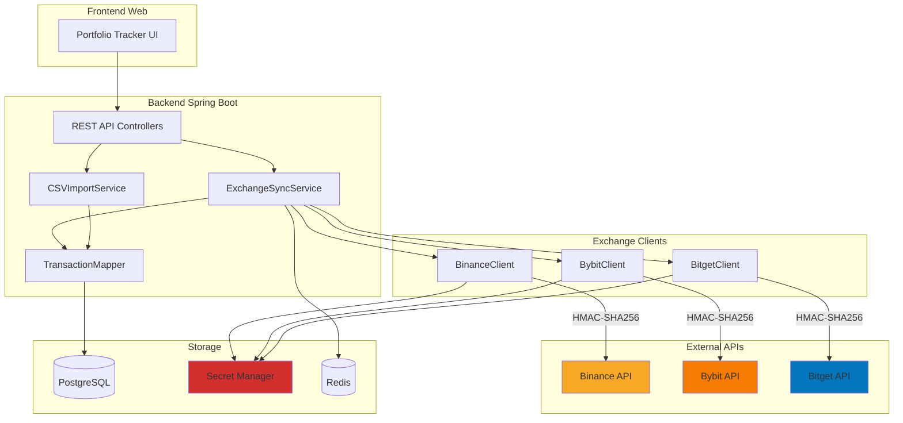

# Integración de Exchange APIs — Portfolio Tracker

> **Guía completa de arquitectura e implementación para sincronización automática de transacciones cripto desde Binance, Bybit, Bitget y otros exchanges**
> 
> Stack: Spring Boot 4.0 · Java 21 · PostgreSQL · Redis · GCP/Azure

---

## 📋 Tabla de Contenidos

- [1. Estrategia recomendada: Implementación híbrida](#1-estrategia-recomendada-implementación-híbrida)
- [2. Arquitectura del sistema](#2-arquitectura-del-sistema)
- [3. Gestión segura de API Keys](#3-gestión-segura-de-api-keys)
- [4. Implementación por exchange](#4-implementación-por-exchange)
  - [4.1 Binance API](#41-binance-api)
  - [4.2 Bybit API](#42-bybit-api)
  - [4.3 Bitget API](#43-bitget-api)
- [5. Modelo de datos unificado](#5-modelo-de-datos-unificado)
- [6. Sincronización automática](#6-sincronización-automática)
- [7. Importación manual CSV](#7-importación-manual-csv)
- [8. Manejo de errores y reintentos](#8-manejo-de-errores-y-reintentos)
- [9. Rate limiting por exchange](#9-rate-limiting-por-exchange)
- [10. Seguridad crítica](#10-seguridad-crítica)
- [11. Testing](#11-testing)
- [12. Roadmap de implementación](#12-roadmap-de-implementación)

---

## 1. Estrategia recomendada: Implementación híbrida

### ✅ Opción 1: Conexión API directa (RECOMENDADO para Binance, Bybit, Bitget)

**Ventajas:**
- ✅ Sincronización automática cada 1-6 horas
- ✅ Usuario no tiene que hacer nada después del setup inicial
- ✅ Detecta automáticamente nuevas transacciones (spot, convert, deposit, withdraw)
- ✅ Datos siempre actualizados sin intervención manual

**Desventajas:**
- ❌ Requiere almacenar API keys (mitigado con cifrado en Secret Manager)
- ❌ Complejidad técnica mayor (diferentes APIs por exchange)
- ❌ Dependencia de la disponibilidad de las APIs externas

**Cuándo usar:**
- Exchanges que ofrecen API (Binance, Bybit, Bitget, Coinbase, Kraken, OKX)
- Usuarios con actividad frecuente (>5 transacciones/semana)
- Usuarios que quieren "set and forget"

---

### ✅ Opción 2: Importación manual CSV (NECESARIO como fallback)

**Ventajas:**
- ✅ Funciona para CUALQUIER exchange (incluso sin API)
- ✅ Usuario tiene control total de qué datos comparte
- ✅ No requiere almacenar API keys
- ✅ Útil para corregir errores o importar data histórica

**Desventajas:**
- ❌ Requiere acción manual del usuario
- ❌ No es tiempo real (solo cuando el usuario importa)
- ❌ Formatos CSV varían entre exchanges

**Cuándo usar:**
- Exchanges SIN API pública (Kraken, algunos exchanges LATAM)
- Como backup si la API falla
- Para importación histórica masiva (años anteriores)
- Usuarios que NO quieren conectar API keys

---

## 2. Arquitectura del sistema



---

## 3. Gestión segura de API Keys

### 🔒 CRÍTICO: NUNCA almacenar API keys en texto plano

Las API keys deben cifrarse con AES-256-GCM **antes** de guardarlas en la base de datos. La clave de cifrado (Data Encryption Key - DEK) se almacena en Secret Manager.

### Modelo de datos: `exchange_connections`

```sql
CREATE TABLE exchange_connections (
    id               UUID PRIMARY KEY DEFAULT gen_random_uuid(),
    user_id          UUID NOT NULL REFERENCES users(id) ON DELETE CASCADE,
    exchange         VARCHAR(50) NOT NULL,  -- 'binance', 'bybit', 'bitget'
    
    -- API credentials (CIFRADAS con AES-256-GCM)
    api_key_encrypted      TEXT NOT NULL,
    api_secret_encrypted   TEXT NOT NULL,
    api_passphrase_encrypted TEXT,  -- Solo para exchanges que lo requieren (OKX, etc)
    
    -- Metadata de cifrado
    encryption_iv          BYTEA NOT NULL,  -- Initialization Vector único
    encryption_algorithm   VARCHAR(50) DEFAULT 'AES-256-GCM',
    
    -- Estado de la conexión
    is_active        BOOLEAN DEFAULT TRUE,
    last_sync_at     TIMESTAMPTZ,
    last_sync_status VARCHAR(50),  -- 'success', 'api_error', 'auth_failed'
    sync_enabled     BOOLEAN DEFAULT TRUE,
    
    -- Permisos (solo lectura)
    permissions      JSONB,  -- {"spot": true, "futures": false, "withdraw": false}
    
    created_at       TIMESTAMPTZ DEFAULT NOW(),
    updated_at       TIMESTAMPTZ DEFAULT NOW(),
    
    CONSTRAINT uniq_user_exchange UNIQUE (user_id, exchange)
);

CREATE INDEX idx_exchange_connections_user ON exchange_connections(user_id);
CREATE INDEX idx_exchange_connections_sync ON exchange_connections(last_sync_at) 
    WHERE sync_enabled = TRUE AND is_active = TRUE;
```

---

### ApiKeyEncryption.java

```java
@Component
public class ApiKeyEncryption {

    private static final String ALGORITHM = "AES/GCM/NoPadding";
    private static final int GCM_IV_LENGTH = 12;  // 96 bits
    private static final int GCM_TAG_LENGTH = 128; // 128 bits

    @Value("${security.api-key.encryption-key}")
    private String encryptionKeyBase64;  // 32 bytes en Base64 desde Secret Manager

    /**
     * Cifra un API key o secret con AES-256-GCM.
     * @return DTO con el texto cifrado y el IV generado
     */
    public EncryptedData encrypt(String plaintext) {
        try {
            // Generar IV aleatorio único para esta operación
            byte[] iv = new byte[GCM_IV_LENGTH];
            new SecureRandom().nextBytes(iv);

            // Preparar cipher con la clave maestra
            Cipher cipher = Cipher.getInstance(ALGORITHM);
            SecretKeySpec keySpec = new SecretKeySpec(
                Base64.getDecoder().decode(encryptionKeyBase64),
                "AES"
            );
            GCMParameterSpec gcmSpec = new GCMParameterSpec(GCM_TAG_LENGTH, iv);
            cipher.init(Cipher.ENCRYPT_MODE, keySpec, gcmSpec);

            // Cifrar
            byte[] ciphertext = cipher.doFinal(plaintext.getBytes(StandardCharsets.UTF_8));

            return new EncryptedData(
                Base64.getEncoder().encodeToString(ciphertext),
                Base64.getEncoder().encodeToString(iv)
            );
        } catch (Exception e) {
            throw new CryptoException("Failed to encrypt API key", e);
        }
    }

    /**
     * Descifra un API key o secret cifrado.
     */
    public String decrypt(String encryptedBase64, String ivBase64) {
        try {
            byte[] ciphertext = Base64.getDecoder().decode(encryptedBase64);
            byte[] iv = Base64.getDecoder().decode(ivBase64);

            Cipher cipher = Cipher.getInstance(ALGORITHM);
            SecretKeySpec keySpec = new SecretKeySpec(
                Base64.getDecoder().decode(encryptionKeyBase64),
                "AES"
            );
            GCMParameterSpec gcmSpec = new GCMParameterSpec(GCM_TAG_LENGTH, iv);
            cipher.init(Cipher.DECRYPT_MODE, keySpec, gcmSpec);

            byte[] plaintext = cipher.doFinal(ciphertext);
            return new String(plaintext, StandardCharsets.UTF_8);
        } catch (Exception e) {
            throw new CryptoException("Failed to decrypt API key", e);
        }
    }

    public record EncryptedData(String ciphertext, String iv) {}
}
```

---

### ExchangeConnection.java (Entidad JPA)

```java
@Entity
@Table(name = "exchange_connections")
public class ExchangeConnection {

    @Id
    @GeneratedValue(strategy = GenerationType.UUID)
    private UUID id;

    @ManyToOne(fetch = FetchType.LAZY)
    @JoinColumn(name = "user_id", nullable = false)
    private User user;

    @Enumerated(EnumType.STRING)
    @Column(nullable = false)
    private Exchange exchange;  // BINANCE, BYBIT, BITGET

    @Column(name = "api_key_encrypted", nullable = false)
    private String apiKeyEncrypted;

    @Column(name = "api_secret_encrypted", nullable = false)
    private String apiSecretEncrypted;

    @Column(name = "api_passphrase_encrypted")
    private String apiPassphraseEncrypted;

    @Column(name = "encryption_iv", nullable = false)
    private byte[] encryptionIv;

    @Column(name = "is_active", nullable = false)
    private boolean active = true;

    @Column(name = "last_sync_at")
    private OffsetDateTime lastSyncAt;

    @Column(name = "last_sync_status")
    private String lastSyncStatus;

    @Column(name = "sync_enabled", nullable = false)
    private boolean syncEnabled = true;

    @Type(JsonType.class)
    @Column(columnDefinition = "jsonb")
    private Map<String, Boolean> permissions;

    // Métodos helper para descifrar (solo en memoria, nunca persistir)
    @Transient
    public ApiCredentials decryptCredentials(ApiKeyEncryption encryption) {
        String ivBase64 = Base64.getEncoder().encodeToString(encryptionIv);
        
        return new ApiCredentials(
            encryption.decrypt(apiKeyEncrypted, ivBase64),
            encryption.decrypt(apiSecretEncrypted, ivBase64),
            apiPassphraseEncrypted != null 
                ? encryption.decrypt(apiPassphraseEncrypted, ivBase64) 
                : null
        );
    }

    public record ApiCredentials(String apiKey, String apiSecret, String passphrase) {}
}

public enum Exchange {
    BINANCE,
    BYBIT,
    BITGET,
    COINBASE,
    KRAKEN,
    OKX
}
```

---

## 4. Implementación por exchange

### 4.1 Binance API

**Documentación oficial:** https://binance-docs.github.io/apidocs/spot/en/

**Endpoints relevantes:**
- `GET /api/v3/account` — Balance de todas las monedas
- `GET /api/v3/myTrades` — Historial de trades spot
- `GET /sapi/v1/asset/assetDetail` — Info de depósitos/retiros
- `GET /sapi/v1/convert/tradeFlow` — Historial de convert

---

#### BinanceClient.java

```java
@Component
@Slf4j
public class BinanceClient {

    private static final String BASE_URL = "https://api.binance.com";
    private final WebClient webClient;
    private final ApiKeyEncryption encryption;

    public BinanceClient(WebClient.Builder builder, ApiKeyEncryption encryption) {
        this.webClient = builder.baseUrl(BASE_URL).build();
        this.encryption = encryption;
    }

    /**
     * Obtiene el historial de trades spot desde un timestamp.
     * @param connection Conexión del usuario con credenciales cifradas
     * @param since Timestamp en milisegundos (default: últimas 24h)
     * @return Lista de trades en formato unificado
     */
    public List<UnifiedTransaction> getSpotTrades(
            ExchangeConnection connection,
            long since) {
        
        var creds = connection.decryptCredentials(encryption);
        
        // Parámetros de la request
        Map<String, String> params = new LinkedHashMap<>();
        params.put("timestamp", String.valueOf(System.currentTimeMillis()));
        params.put("startTime", String.valueOf(since));
        params.put("recvWindow", "5000");

        // Firmar request con HMAC-SHA256
        String signature = signRequest(params, creds.apiSecret());
        params.put("signature", signature);

        // Hacer request
        String queryString = buildQueryString(params);
        
        return webClient.get()
            .uri("/api/v3/myTrades?" + queryString)
            .header("X-MBX-APIKEY", creds.apiKey())
            .retrieve()
            .bodyToMono(new ParameterizedTypeReference<List<BinanceSpotTrade>>() {})
            .map(trades -> trades.stream()
                .map(this::mapToUnifiedTransaction)
                .toList())
            .block();
    }

    /**
     * Firma la request con HMAC-SHA256 según la especificación de Binance.
     */
    private String signRequest(Map<String, String> params, String apiSecret) {
        try {
            String queryString = buildQueryString(params);
            Mac mac = Mac.getInstance("HmacSHA256");
            mac.init(new SecretKeySpec(apiSecret.getBytes(), "HmacSHA256"));
            byte[] hash = mac.doFinal(queryString.getBytes(StandardCharsets.UTF_8));
            return Hex.encodeHexString(hash);  // Apache Commons Codec
        } catch (Exception e) {
            throw new ExchangeApiException("Failed to sign Binance request", e);
        }
    }

    private String buildQueryString(Map<String, String> params) {
        return params.entrySet().stream()
            .map(e -> e.getKey() + "=" + e.getValue())
            .collect(Collectors.joining("&"));
    }

    private UnifiedTransaction mapToUnifiedTransaction(BinanceSpotTrade trade) {
        return UnifiedTransaction.builder()
            .exchangeId(trade.id().toString())
            .exchange(Exchange.BINANCE)
            .type(trade.isBuyer() ? TransactionType.BUY : TransactionType.SELL)
            .baseAsset(extractBaseAsset(trade.symbol()))
            .quoteAsset(extractQuoteAsset(trade.symbol()))
            .quantity(new BigDecimal(trade.qty()))
            .price(new BigDecimal(trade.price()))
            .fee(new BigDecimal(trade.commission()))
            .feeAsset(trade.commissionAsset())
            .timestamp(Instant.ofEpochMilli(trade.time()))
            .build();
    }

    // DTO de respuesta de Binance
    private record BinanceSpotTrade(
        Long id,
        String symbol,      // "BTCUSDT"
        String price,
        String qty,
        String commission,
        String commissionAsset,
        Long time,
        Boolean isBuyer
    ) {}
}
```

---

### 4.2 Bybit API

**Documentación:** https://bybit-exchange.github.io/docs/v5/intro

**Diferencias clave vs Binance:**
- Usa header `X-BAPI-SIGN` en lugar de query param `signature`
- Requiere `X-BAPI-TIMESTAMP` y `X-BAPI-RECV-WINDOW`
- El signature se calcula sobre: `timestamp + apiKey + recvWindow + queryString + body`

---

#### BybitClient.java

```java
@Component
public class BybitClient {

    private static final String BASE_URL = "https://api.bybit.com";
    private final WebClient webClient;
    private final ApiKeyEncryption encryption;

    public List<UnifiedTransaction> getSpotTrades(
            ExchangeConnection connection,
            long since) {
        
        var creds = connection.decryptCredentials(encryption);
        
        long timestamp = System.currentTimeMillis();
        String recvWindow = "5000";
        
        // Bybit usa orden específico para firma
        String toSign = timestamp + creds.apiKey() + recvWindow;
        String signature = signRequest(toSign, creds.apiSecret());

        return webClient.get()
            .uri(uriBuilder -> uriBuilder
                .path("/v5/execution/list")
                .queryParam("category", "spot")
                .queryParam("startTime", since)
                .build())
            .header("X-BAPI-API-KEY", creds.apiKey())
            .header("X-BAPI-TIMESTAMP", String.valueOf(timestamp))
            .header("X-BAPI-SIGN", signature)
            .header("X-BAPI-RECV-WINDOW", recvWindow)
            .retrieve()
            .bodyToMono(BybitResponse.class)
            .map(response -> response.result().list().stream()
                .map(this::mapToUnifiedTransaction)
                .toList())
            .block();
    }

    private String signRequest(String payload, String apiSecret) {
        try {
            Mac mac = Mac.getInstance("HmacSHA256");
            mac.init(new SecretKeySpec(apiSecret.getBytes(), "HmacSHA256"));
            byte[] hash = mac.doFinal(payload.getBytes(StandardCharsets.UTF_8));
            return Hex.encodeHexString(hash);
        } catch (Exception e) {
            throw new ExchangeApiException("Failed to sign Bybit request", e);
        }
    }

    private record BybitResponse(
        int retCode,
        String retMsg,
        Result result
    ) {
        record Result(List<Execution> list) {}
        record Execution(
            String execId,
            String symbol,
            String side,      // "Buy" o "Sell"
            String execPrice,
            String execQty,
            String execFee,
            String feeRate,
            Long execTime
        ) {}
    }
}
```

---

### 4.3 Bitget API

**Documentación:** https://bitgetlimited.github.io/apidoc/en/spot/

**Diferencias clave:**
- Requiere header `ACCESS-PASSPHRASE` además de key/secret
- El signature se calcula sobre: `timestamp + method + requestPath + queryString + body`

---

#### BitgetClient.java

```java
@Component
public class BitgetClient {

    private static final String BASE_URL = "https://api.bitget.com";
    private final WebClient webClient;
    private final ApiKeyEncryption encryption;

    public List<UnifiedTransaction> getSpotTrades(
            ExchangeConnection connection,
            long since) {
        
        var creds = connection.decryptCredentials(encryption);
        
        String timestamp = String.valueOf(System.currentTimeMillis());
        String method = "GET";
        String requestPath = "/api/spot/v1/trade/fills";
        
        // Construir query string
        String queryString = "?startTime=" + since;
        
        // Bitget: signature = HMAC-SHA256(timestamp + method + requestPath + queryString)
        String toSign = timestamp + method + requestPath + queryString;
        String signature = signRequest(toSign, creds.apiSecret());

        return webClient.get()
            .uri(requestPath + queryString)
            .header("ACCESS-KEY", creds.apiKey())
            .header("ACCESS-SIGN", signature)
            .header("ACCESS-TIMESTAMP", timestamp)
            .header("ACCESS-PASSPHRASE", creds.passphrase())  // REQUERIDO en Bitget
            .retrieve()
            .bodyToMono(BitgetResponse.class)
            .map(response -> response.data().stream()
                .map(this::mapToUnifiedTransaction)
                .toList())
            .block();
    }

    private String signRequest(String payload, String apiSecret) {
        try {
            Mac mac = Mac.getInstance("HmacSHA256");
            mac.init(new SecretKeySpec(apiSecret.getBytes(), "HmacSHA256"));
            byte[] hash = mac.doFinal(payload.getBytes(StandardCharsets.UTF_8));
            return Base64.getEncoder().encodeToString(hash);  // Bitget usa Base64, no hex
        } catch (Exception e) {
            throw new ExchangeApiException("Failed to sign Bitget request", e);
        }
    }

    private record BitgetResponse(List<Fill> data) {
        record Fill(
            String tradeId,
            String symbol,
            String side,       // "buy" o "sell"
            String fillPrice,
            String fillQuantity,
            String fillFeeAmount,
            String feeCoin,
            Long cTime
        ) {}
    }
}
```

---

## 5. Modelo de datos unificado

Todas las transacciones de todos los exchanges se normalizan a este formato:

```java
@Entity
@Table(name = "crypto_transactions")
public class CryptoTransaction {

    @Id
    @GeneratedValue(strategy = GenerationType.UUID)
    private UUID id;

    @ManyToOne(fetch = FetchType.LAZY)
    @JoinColumn(name = "portfolio_id", nullable = false)
    private Portfolio portfolio;

    // Identificación del exchange
    @Enumerated(EnumType.STRING)
    @Column(nullable = false)
    private Exchange exchange;

    @Column(name = "exchange_trade_id")  // ID original del exchange (para deduplicación)
    private String exchangeTradeId;

    // Tipo de transacción
    @Enumerated(EnumType.STRING)
    @Column(nullable = false)
    private CryptoTransactionType type;  // BUY, SELL, DEPOSIT, WITHDRAW, CONVERT, STAKING

    // Activos involucrados
    @Column(name = "base_asset", length = 20)
    private String baseAsset;   // BTC, ETH, USDT

    @Column(name = "quote_asset", length = 20)
    private String quoteAsset;  // USDT (en pares como BTC/USDT)

    // Cantidades
    @Column(precision = 30, scale = 18, nullable = false)
    private BigDecimal quantity;

    @Column(precision = 30, scale = 18)
    private BigDecimal price;  // null para deposits/withdraws

    // Fee
    @Column(name = "fee_amount", precision = 30, scale = 18)
    private BigDecimal feeAmount;

    @Column(name = "fee_asset", length = 20)
    private String feeAsset;

    // Timestamp
    @Column(name = "executed_at", nullable = false)
    private OffsetDateTime executedAt;

    // Metadata
    @Column(name = "import_source")
    private String importSource;  // "api_sync", "csv_import", "manual"

    @Column(name = "synced_at")
    private OffsetDateTime syncedAt;

    @Column(name = "created_at")
    private OffsetDateTime createdAt;

    // Constraint para evitar duplicados
    // UNIQUE (exchange, exchange_trade_id) por portfolio
}

public enum CryptoTransactionType {
    BUY,         // Compra spot
    SELL,        // Venta spot
    DEPOSIT,     // Depósito de cripto al exchange
    WITHDRAW,    // Retiro de cripto del exchange
    CONVERT,     // Conversión entre pares (Binance Convert)
    STAKING,     // Recompensas de staking
    AIRDROP,     // Airdrops
    TRANSFER     // Transferencias entre cuentas del mismo exchange
}
```

---

## 6. Sincronización automática

### ExchangeSyncService.java

```java
@Service
@Slf4j
public class ExchangeSyncService {

    private final ExchangeConnectionRepository connectionRepo;
    private final CryptoTransactionRepository transactionRepo;
    private final BinanceClient binanceClient;
    private final BybitClient bybitClient;
    private final BitgetClient bitgetClient;

    /**
     * Job programado: sincroniza TODAS las conexiones activas cada 6 horas.
     */
    @Scheduled(fixedRate = 21600000)  // 6 horas
    public void syncAllConnections() {
        log.info("Starting scheduled sync for all exchange connections");

        List<ExchangeConnection> connections = connectionRepo
            .findAllBySyncEnabledTrueAndActiveTrue();

        for (ExchangeConnection conn : connections) {
            try {
                syncConnection(conn);
            } catch (Exception e) {
                log.error("Sync failed for user {} exchange {}: {}", 
                    conn.getUser().getId(), conn.getExchange(), e.getMessage());
                
                conn.setLastSyncStatus("error: " + e.getMessage());
                conn.setLastSyncAt(OffsetDateTime.now());
                connectionRepo.save(conn);
            }
        }
    }

    /**
     * Sincroniza una conexión específica (puede llamarse manualmente).
     */
    @Transactional
    public SyncResult syncConnection(ExchangeConnection connection) {
        log.info("Syncing {} for user {}", 
            connection.getExchange(), connection.getUser().getId());

        // Calcular timestamp desde: última sincronización O últimas 24h
        long since = connection.getLastSyncAt() != null
            ? connection.getLastSyncAt().toInstant().toEpochMilli()
            : System.currentTimeMillis() - (24 * 60 * 60 * 1000);

        // Delegar al cliente específico del exchange
        List<UnifiedTransaction> transactions = switch (connection.getExchange()) {
            case BINANCE -> binanceClient.getSpotTrades(connection, since);
            case BYBIT   -> bybitClient.getSpotTrades(connection, since);
            case BITGET  -> bitgetClient.getSpotTrades(connection, since);
            default -> throw new UnsupportedOperationException(
                "Exchange not supported: " + connection.getExchange());
        };

        // Guardar transacciones (deduplicando por exchange_trade_id)
        int inserted = 0;
        int skipped = 0;

        for (UnifiedTransaction tx : transactions) {
            boolean exists = transactionRepo.existsByExchangeAndExchangeTradeId(
                tx.exchange(), tx.exchangeId()
            );

            if (!exists) {
                CryptoTransaction entity = mapToEntity(tx, connection);
                transactionRepo.save(entity);
                inserted++;
            } else {
                skipped++;
            }
        }

        // Actualizar estado de la conexión
        connection.setLastSyncAt(OffsetDateTime.now());
        connection.setLastSyncStatus("success");
        connectionRepo.save(connection);

        log.info("Sync completed: {} new, {} skipped (duplicates)", inserted, skipped);
        return new SyncResult(inserted, skipped);
    }

    private CryptoTransaction mapToEntity(
            UnifiedTransaction tx, 
            ExchangeConnection connection) {
        
        return CryptoTransaction.builder()
            .portfolio(connection.getUser().getDefaultPortfolio())
            .exchange(tx.exchange())
            .exchangeTradeId(tx.exchangeId())
            .type(tx.type())
            .baseAsset(tx.baseAsset())
            .quoteAsset(tx.quoteAsset())
            .quantity(tx.quantity())
            .price(tx.price())
            .feeAmount(tx.fee())
            .feeAsset(tx.feeAsset())
            .executedAt(OffsetDateTime.ofInstant(tx.timestamp(), ZoneOffset.UTC))
            .importSource("api_sync")
            .syncedAt(OffsetDateTime.now())
            .build();
    }

    public record SyncResult(int inserted, int skipped) {}
}

// DTO unificado para todas las exchanges
public record UnifiedTransaction(
    String exchangeId,
    Exchange exchange,
    CryptoTransactionType type,
    String baseAsset,
    String quoteAsset,
    BigDecimal quantity,
    BigDecimal price,
    BigDecimal fee,
    String feeAsset,
    Instant timestamp
) {}
```

---

## 7. Importación manual CSV

Para exchanges sin API o como fallback, implementar importación CSV:

### CSVImportService.java

```java
@Service
public class CSVImportService {

    private final CryptoTransactionRepository transactionRepo;

    /**
     * Importa transacciones desde un archivo CSV.
     * Formato esperado: Binance, Bybit o Bitget export format
     */
    public ImportResult importFromCSV(
            MultipartFile file,
            Portfolio portfolio,
            Exchange exchange) throws IOException {

        List<String[]> rows = parseCsv(file);
        
        // Detectar formato según el exchange
        CSVParser parser = switch (exchange) {
            case BINANCE -> new BinanceCSVParser();
            case BYBIT   -> new BybitCSVParser();
            case BITGET  -> new BitgetCSVParser();
            default -> throw new IllegalArgumentException("Unsupported exchange");
        };

        int imported = 0;
        int skipped = 0;

        for (String[] row : rows) {
            try {
                CryptoTransaction tx = parser.parse(row, portfolio);
                
                // Verificar duplicado
                boolean exists = transactionRepo.existsByExchangeAndExchangeTradeId(
                    exchange, tx.getExchangeTradeId()
                );

                if (!exists) {
                    transactionRepo.save(tx);
                    imported++;
                } else {
                    skipped++;
                }
            } catch (Exception e) {
                log.warn("Failed to parse CSV row: {}", Arrays.toString(row), e);
            }
        }

        return new ImportResult(imported, skipped);
    }

    private List<String[]> parseCsv(MultipartFile file) throws IOException {
        try (Reader reader = new InputStreamReader(file.getInputStream());
             CSVReader csvReader = new CSVReader(reader)) {
            return csvReader.readAll();
        }
    }

    public record ImportResult(int imported, int skipped) {}
}
```

---

## 8. Manejo de errores y reintentos

```java
@Component
public class ExchangeApiErrorHandler {

    /**
     * Política de reintentos exponencial con jitter.
     */
    public <T> T executeWithRetry(Supplier<T> apiCall, Exchange exchange) {
        int maxRetries = 3;
        long baseDelay = 1000;  // 1 segundo

        for (int attempt = 0; attempt < maxRetries; attempt++) {
            try {
                return apiCall.get();
            } catch (WebClientResponseException e) {
                if (isRetryable(e.getStatusCode())) {
                    long delay = calculateBackoff(baseDelay, attempt);
                    log.warn("API call failed (attempt {}/{}), retrying in {}ms: {}", 
                        attempt + 1, maxRetries, delay, e.getMessage());
                    sleep(delay);
                } else {
                    throw new ExchangeApiException(
                        "Non-retryable error: " + e.getStatusCode(), e);
                }
            }
        }

        throw new ExchangeApiException("Max retries exceeded");
    }

    private boolean isRetryable(HttpStatusCode status) {
        return status.value() == 429    // Rate limit
            || status.value() == 502    // Bad gateway
            || status.value() == 503    // Service unavailable
            || status.value() == 504;   // Gateway timeout
    }

    private long calculateBackoff(long baseDelay, int attempt) {
        // Exponencial con jitter: delay = base * 2^attempt + random(0-1000)
        long exponential = (long) (baseDelay * Math.pow(2, attempt));
        long jitter = ThreadLocalRandom.current().nextLong(0, 1000);
        return exponential + jitter;
    }

    private void sleep(long millis) {
        try {
            Thread.sleep(millis);
        } catch (InterruptedException e) {
            Thread.currentThread().interrupt();
            throw new RuntimeException(e);
        }
    }
}
```

---

## 9. Rate limiting por exchange

Cada exchange tiene límites diferentes:

| Exchange | Límite público | Límite con API key | Ventana |
|----------|----------------|-------------------|---------|
| **Binance** | 1200 req/min | 6000 req/min | 1 minuto |
| **Bybit** | 50 req/s | 120 req/s | 1 segundo |
| **Bitget** | 20 req/s | 40 req/s | 1 segundo |

### Implementar con Bucket4j + Redis:

```java
@Component
public class ExchangeRateLimiter {

    private final RedissonClient redisson;
    private final Map<Exchange, BucketConfiguration> configs = Map.of(
        Exchange.BINANCE, BucketConfiguration.builder()
            .addLimit(Bandwidth.simple(6000, Duration.ofMinutes(1)))
            .build(),
        Exchange.BYBIT, BucketConfiguration.builder()
            .addLimit(Bandwidth.simple(120, Duration.ofSeconds(1)))
            .build(),
        Exchange.BITGET, BucketConfiguration.builder()
            .addLimit(Bandwidth.simple(40, Duration.ofSeconds(1)))
            .build()
    );

    public void checkLimit(Exchange exchange) {
        String key = "rate-limit:" + exchange.name();
        Bucket bucket = Bucket4jRedisson
            .extension(redisson)
            .builder()
            .build(key, configs.get(exchange));

        if (!bucket.tryConsume(1)) {
            throw new RateLimitExceededException(
                "Rate limit exceeded for " + exchange);
        }
    }
}
```

---

## 10. Seguridad crítica

### ⚠️ NUNCA hacer:

1. ❌ Almacenar API keys en texto plano en la base de datos
2. ❌ Loggear API keys o secrets (ni siquiera en desarrollo)
3. ❌ Permitir permisos de escritura (`withdraw`, `trade`) en las API keys
4. ❌ Exponer API keys en responses HTTP al frontend
5. ❌ Usar las mismas API keys en múltiples servicios

### ✅ SIEMPRE hacer:

1. ✅ Cifrar con AES-256-GCM antes de guardar en DB
2. ✅ Almacenar la clave de cifrado (DEK) en Secret Manager
3. ✅ Usar SOLO permisos de lectura (`READ`, `SPOT_READ`)
4. ✅ Validar que las API keys NO tengan permisos de withdraw
5. ✅ Implementar timeout corto en `WebClient` (5-10 segundos)
6. ✅ Loggear SOLO el userId y el exchange, nunca credenciales
7. ✅ Permitir al usuario revocar/regenerar keys desde el UI

---

## 11. Testing

### ExchangeSyncServiceTest.java

```java
@SpringBootTest
class ExchangeSyncServiceTest {

    @Autowired ExchangeSyncService syncService;
    @MockBean BinanceClient binanceClient;
    @Autowired ExchangeConnectionRepository connectionRepo;
    @Autowired CryptoTransactionRepository transactionRepo;

    @Test
    @DisplayName("syncConnection - should import new transactions and skip duplicates")
    void syncConnection_shouldImportAndDeduplicate() {
        // Arrange: crear conexión de prueba
        ExchangeConnection conn = createTestConnection(Exchange.BINANCE);
        connectionRepo.save(conn);

        // Mock de respuesta de Binance
        List<UnifiedTransaction> mockTrades = List.of(
            new UnifiedTransaction("12345", Exchange.BINANCE, CryptoTransactionType.BUY,
                "BTC", "USDT", new BigDecimal("0.5"), new BigDecimal("42000"),
                new BigDecimal("21"), "USDT", Instant.now()),
            new UnifiedTransaction("12346", Exchange.BINANCE, CryptoTransactionType.SELL,
                "ETH", "USDT", new BigDecimal("2.0"), new BigDecimal("2800"),
                new BigDecimal("5.6"), "USDT", Instant.now())
        );

        when(binanceClient.getSpotTrades(eq(conn), anyLong()))
            .thenReturn(mockTrades);

        // Act
        SyncResult result = syncService.syncConnection(conn);

        // Assert
        assertThat(result.inserted()).isEqualTo(2);
        assertThat(result.skipped()).isEqualTo(0);
        
        // Verificar que se guardaron en BD
        List<CryptoTransaction> saved = transactionRepo.findAll();
        assertThat(saved).hasSize(2);
        assertThat(saved.get(0).getExchangeTradeId()).isEqualTo("12345");

        // Segunda sincronización: debe detectar duplicados
        SyncResult result2 = syncService.syncConnection(conn);
        assertThat(result2.inserted()).isEqualTo(0);
        assertThat(result2.skipped()).isEqualTo(2);
    }
}
```

---

## 12. Roadmap de implementación

### Fase 1: Fundamentos (Semana 1-2)
- [ ] Crear tabla `exchange_connections`
- [ ] Implementar `ApiKeyEncryption` con AES-256-GCM
- [ ] Configurar Secret Manager (GCP o Azure) con encryption key
- [ ] Crear entidad `ExchangeConnection` + repository
- [ ] Endpoint: `POST /api/v1/exchanges/connect` (guardar API keys cifradas)

### Fase 2: Cliente Binance (Semana 3)
- [ ] Implementar `BinanceClient.getSpotTrades()`
- [ ] Implementar firma HMAC-SHA256 para Binance
- [ ] Crear modelo `UnifiedTransaction`
- [ ] Crear `ExchangeSyncService.syncConnection()`
- [ ] Testing: mock de Binance API

### Fase 3: Clientes Bybit y Bitget (Semana 4)
- [ ] Implementar `BybitClient.getSpotTrades()`
- [ ] Implementar `BitgetClient.getSpotTrades()`
- [ ] Adaptar diferencias de firma por exchange
- [ ] Testing: cobertura 80%+

### Fase 4: Sincronización automática (Semana 5)
- [ ] Job `@Scheduled` cada 6 horas
- [ ] Implementar `ExchangeApiErrorHandler` con reintentos
- [ ] Implementar rate limiting con Bucket4j + Redis
- [ ] Logging estructurado (éxito/fallo por exchange)

### Fase 5: Importación CSV (Semana 6)
- [ ] Implementar `CSVImportService`
- [ ] Parsers para formato CSV de Binance/Bybit/Bitget
- [ ] Endpoint: `POST /api/v1/transactions/import/csv`
- [ ] Validación de formato + deduplicación

### Fase 6: UI y UX (Semana 7-8)
- [ ] Pantalla: Conectar exchange (formulario API key/secret)
- [ ] Pantalla: Ver estado de sincronización
- [ ] Pantalla: Importar CSV manualmente
- [ ] Botón: "Sincronizar ahora" (trigger manual)
- [ ] Notificaciones: éxito/fallo de sincronización

---

## 📚 Referencias

- [Binance API Documentation](https://binance-docs.github.io/apidocs/spot/en/)
- [Bybit API Documentation](https://bybit-exchange.github.io/docs/v5/intro)
- [Bitget API Documentation](https://bitgetlimited.github.io/apidoc/en/spot/)
- [OWASP - Cryptographic Storage Cheat Sheet](https://cheatsheetseries.owasp.org/cheatsheets/Cryptographic_Storage_Cheat_Sheet.html)
- [Java Cryptography Architecture (JCA)](https://docs.oracle.com/en/java/javase/21/security/java-cryptography-architecture-jca-reference-guide.html)

---

## 📄 Licencia

Documentación técnica — Portfolio Tracker  
Stack: Spring Boot 4.0 · Java 21 · PostgreSQL · Redis · GCP/Azure  
Versión: 1.0 · Febrero 2026
