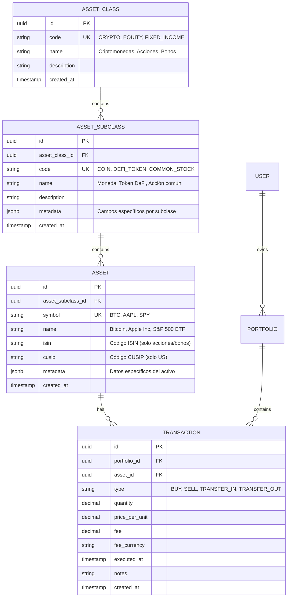

# Sistema Multi-Asset Portfolio — Clasificación de Activos

> **Arquitectura completa para portafolio diversificado con soporte para cripto, acciones, bonos, índices, futuros, forex y más**
>
> Basado en TradingView Bond Screener - Stack: Spring Boot 4.0 · PostgreSQL · Java 21

---

## 📋 Tabla de Contenidos

- [1. Análisis de TradingView Bond Screener](#1-análisis-de-tradingview-bond-screener)
- [2. Taxonomía de activos financieros](#2-taxonomía-de-activos-financieros)
- [3. Modelo de datos jerárquico](#3-modelo-de-datos-jerárquico)
- [4. Implementación en PostgreSQL](#4-implementación-en-postgresql)
- [5. Entidades JPA](#5-entidades-jpa)
- [6. API REST endpoints](#6-api-rest-endpoints)
- [7. UI: Formulario Add Transaction](#7-ui-formulario-add-transaction)
- [8. Validación por tipo de activo](#8-validación-por-tipo-de-activo)
- [9. Casos de uso por categoría](#9-casos-de-uso-por-categoría)
- [10. Migración desde sistema mono-asset](#10-migración-desde-sistema-mono-asset)

---

## 1. Análisis de TradingView Bond Screener

### Captura 1: Criptomonedas

**Categorías observadas:**

```
COINS (Panel izquierdo)
├── All coins
├── DeFi coins
├── Most value locked
├── Top gainers
├── Top losers
├── Large-cap
├── Most traded
├── Most transactions
├── Highest supply
└── Lowest supply
```

**Ejemplos de activos:**
- Bitcoin (BTC): `$74,619.23` ↓0.37%
- Ethereum (ETH): `$2,834.80` ↓0.80%
- Tether (USDT): `$1.0002` ↑0.01%
- Binance Coin (BNB): `$673.64` ↓0.90%
- USD Coin (USDC): `$0.99974` ↓0.05%
- XRP: `$1.5320` ↓0.74%

---

### Captura 2: Acciones (Stocks)

**Categorías observadas:**

```
US STOCKS
├── All stocks
├── Large-cap
├── Top gainers
├── Top losers
├── Pre-market gainers
└── After-hours gainers

WORLD STOCKS
├── World biggest companies
├── Largest non-US companies
└── World largest employers
```

**Ejemplos de activos:**
- NVIDIA: `$181.93` ↓0.70%
- Apple: `$254.23` ↑0.56%
- Amazon: `$215.20` ↑1.63%
- Alphabet: `$310.92` ↑1.75%
- Tesla: `$399.27` ↑0.94%
- Microsoft: `$399.41` ↓0.14%

---

### Captura 3: Índices

**Categorías observadas:**

```
QUOTES
├── All indices
├── Major world indices
├── US indices
├── S&P sectors
└── Currency indices
```

**Ejemplos de activos:**
- S&P 500: `$6,716.08` ↑0.25%
- Nasdaq 100: `$24,780.42` ↑0.51%
- Dow 30: `$46,993.27` ↑0.10%
- Japan 225: `$53,700.34` ↓0.09%
- FTSE 100: `$10,403.60` ↑0.83%
- DAX: `$23,730.92` ↑0.71%
- CAC 40: `$7,974.49` ↑0.49%

---

### Categorías adicionales visibles en el menú

```
ASSETS (Menú derecho)
├── Indices
├── Stocks
├── Crypto
├── Futures
├── Forex
├── Government bonds
├── Corporate bonds
├── ETFs
└── Economy
```

---

## 2. Taxonomía de activos financieros

### Jerarquía completa de clases de activos

```
ASSET_CLASS (Nivel 1)
├── CRYPTO (Criptomonedas)
│   ├── COIN (Monedas: BTC, ETH)
│   ├── DEFI_TOKEN (Tokens DeFi: UNI, AAVE)
│   ├── STABLECOIN (Estables: USDT, USDC)
│   ├── NFT (Non-Fungible Tokens)
│   └── WRAPPED_TOKEN (Wrapped: WBTC, WETH)
│
├── EQUITY (Acciones)
│   ├── COMMON_STOCK (Acciones comunes)
│   ├── PREFERRED_STOCK (Acciones preferentes)
│   ├── ADR (American Depositary Receipt)
│   └── ETF (Exchange-Traded Fund)
│
├── FIXED_INCOME (Renta fija)
│   ├── GOVERNMENT_BOND (Bonos gubernamentales)
│   ├── CORPORATE_BOND (Bonos corporativos)
│   ├── MUNICIPAL_BOND (Bonos municipales)
│   └── TREASURY (Bonos del Tesoro)
│
├── INDEX (Índices)
│   ├── STOCK_INDEX (S&P 500, Nasdaq)
│   ├── BOND_INDEX (Bloomberg Aggregate)
│   ├── COMMODITY_INDEX (CRB Index)
│   └── CURRENCY_INDEX (DXY)
│
├── DERIVATIVE (Derivados)
│   ├── FUTURES (Futuros)
│   ├── OPTIONS (Opciones)
│   ├── SWAP (Swaps)
│   └── CFD (Contracts for Difference)
│
├── FOREX (Divisas)
│   ├── MAJOR_PAIR (EUR/USD, GBP/USD)
│   ├── MINOR_PAIR (EUR/GBP, AUD/NZD)
│   └── EXOTIC_PAIR (USD/MXN, USD/TRY)
│
├── COMMODITY (Commodities)
│   ├── PRECIOUS_METAL (Oro, Plata)
│   ├── ENERGY (Petróleo, Gas)
│   ├── AGRICULTURAL (Trigo, Maíz)
│   └── INDUSTRIAL_METAL (Cobre, Aluminio)
│
└── ALTERNATIVE (Alternativos)
    ├── REAL_ESTATE (Bienes raíces)
    ├── PRIVATE_EQUITY (Capital privado)
    ├── HEDGE_FUND (Fondos de cobertura)
    └── ART_COLLECTIBLES (Arte/Coleccionables)
```

---

## 3. Modelo de datos jerárquico

### Esquema ER



---

## 4. Implementación en PostgreSQL

### Tabla: asset_classes

```sql
CREATE TABLE asset_classes (
    id                UUID PRIMARY KEY DEFAULT gen_random_uuid(),
    code              VARCHAR(50) NOT NULL UNIQUE,
    name              VARCHAR(100) NOT NULL,
    description       TEXT,
    display_order     INTEGER DEFAULT 0,
    is_active         BOOLEAN DEFAULT TRUE,
    created_at        TIMESTAMPTZ DEFAULT NOW(),
    updated_at        TIMESTAMPTZ DEFAULT NOW()
);

-- Datos iniciales
INSERT INTO asset_classes (code, name, description, display_order) VALUES
    ('CRYPTO', 'Criptomonedas', 'Monedas digitales y tokens blockchain', 1),
    ('EQUITY', 'Acciones', 'Participaciones en empresas', 2),
    ('FIXED_INCOME', 'Renta Fija', 'Bonos y valores de deuda', 3),
    ('INDEX', 'Índices', 'Índices de mercado', 4),
    ('DERIVATIVE', 'Derivados', 'Futuros, opciones y swaps', 5),
    ('FOREX', 'Divisas', 'Pares de monedas', 6),
    ('COMMODITY', 'Commodities', 'Materias primas', 7),
    ('ALTERNATIVE', 'Alternativos', 'Inversiones alternativas', 8);
```

---

### Tabla: asset_subclasses

```sql
CREATE TABLE asset_subclasses (
    id                UUID PRIMARY KEY DEFAULT gen_random_uuid(),
    asset_class_id    UUID NOT NULL REFERENCES asset_classes(id) ON DELETE CASCADE,
    code              VARCHAR(50) NOT NULL,
    name              VARCHAR(100) NOT NULL,
    description       TEXT,
    
    -- Metadata específica por subclase (JSONB flexible)
    metadata          JSONB DEFAULT '{}',
    -- Ejemplo para CRYPTO:
    -- { "blockchain": "ethereum", "token_standard": "ERC-20" }
    -- Ejemplo para EQUITY:
    -- { "exchange": "NYSE", "sector": "Technology", "market_cap_category": "Large Cap" }
    
    display_order     INTEGER DEFAULT 0,
    is_active         BOOLEAN DEFAULT TRUE,
    created_at        TIMESTAMPTZ DEFAULT NOW(),
    updated_at        TIMESTAMPTZ DEFAULT NOW(),
    
    CONSTRAINT uniq_subclass_code UNIQUE (asset_class_id, code)
);

CREATE INDEX idx_asset_subclasses_class ON asset_subclasses(asset_class_id);

-- Datos iniciales para CRYPTO
INSERT INTO asset_subclasses (asset_class_id, code, name, description, display_order) 
SELECT id, 'COIN', 'Moneda', 'Criptomoneda nativa (BTC, ETH)', 1 FROM asset_classes WHERE code = 'CRYPTO'
UNION ALL
SELECT id, 'DEFI_TOKEN', 'Token DeFi', 'Tokens de finanzas descentralizadas', 2 FROM asset_classes WHERE code = 'CRYPTO'
UNION ALL
SELECT id, 'STABLECOIN', 'Stablecoin', 'Criptomoneda estable (USDT, USDC)', 3 FROM asset_classes WHERE code = 'CRYPTO';

-- Datos iniciales para EQUITY
INSERT INTO asset_subclasses (asset_class_id, code, name, description, display_order) 
SELECT id, 'COMMON_STOCK', 'Acción Común', 'Acción ordinaria con derecho a voto', 1 FROM asset_classes WHERE code = 'EQUITY'
UNION ALL
SELECT id, 'ETF', 'ETF', 'Fondo cotizado en bolsa', 2 FROM asset_classes WHERE code = 'EQUITY';

-- Datos iniciales para FIXED_INCOME
INSERT INTO asset_subclasses (asset_class_id, code, name, description, display_order) 
SELECT id, 'GOVERNMENT_BOND', 'Bono Gubernamental', 'Deuda soberana', 1 FROM asset_classes WHERE code = 'FIXED_INCOME'
UNION ALL
SELECT id, 'CORPORATE_BOND', 'Bono Corporativo', 'Deuda empresarial', 2 FROM asset_classes WHERE code = 'FIXED_INCOME';
```

---

### Tabla: assets

```sql
CREATE TABLE assets (
    id                  UUID PRIMARY KEY DEFAULT gen_random_uuid(),
    asset_subclass_id   UUID NOT NULL REFERENCES asset_subclasses(id) ON DELETE CASCADE,
    
    -- Identificadores comunes
    symbol              VARCHAR(20) NOT NULL,    -- BTC, AAPL, SPY
    name                VARCHAR(200) NOT NULL,   -- Bitcoin, Apple Inc.
    
    -- Identificadores específicos de mercados tradicionales
    isin                VARCHAR(12),             -- International Securities Identification Number
    cusip               VARCHAR(9),              -- Committee on Uniform Securities Identification Procedures
    sedol               VARCHAR(7),              -- Stock Exchange Daily Official List
    
    -- Identificadores específicos de cripto
    coingecko_id        VARCHAR(100),            -- bitcoin, ethereum
    coinmarketcap_id    INTEGER,                 -- 1, 1027
    contract_address    VARCHAR(100),            -- 0x... (para tokens ERC-20, etc)
    
    -- Metadata flexible por tipo de activo (JSONB)
    metadata            JSONB DEFAULT '{}',
    -- Ejemplo CRYPTO:
    -- { "blockchain": "ethereum", "decimals": 18, "is_native": false }
    -- Ejemplo EQUITY:
    -- { "exchange": "NASDAQ", "sector": "Technology", "industry": "Consumer Electronics", 
    --   "country": "US", "currency": "USD", "market_cap": 2800000000000 }
    -- Ejemplo BOND:
    -- { "issuer": "U.S. Treasury", "maturity_date": "2030-09-17", "coupon_rate": 2.66,
    --   "currency": "EUR", "rating": "AAA" }
    
    is_active           BOOLEAN DEFAULT TRUE,
    created_at          TIMESTAMPTZ DEFAULT NOW(),
    updated_at          TIMESTAMPTZ DEFAULT NOW(),
    
    CONSTRAINT uniq_asset_symbol UNIQUE (asset_subclass_id, symbol)
);

CREATE INDEX idx_assets_subclass ON assets(asset_subclass_id);
CREATE INDEX idx_assets_symbol ON assets(symbol);
CREATE INDEX idx_assets_isin ON assets(isin) WHERE isin IS NOT NULL;
CREATE INDEX idx_assets_coingecko ON assets(coingecko_id) WHERE coingecko_id IS NOT NULL;
CREATE INDEX idx_assets_metadata ON assets USING gin(metadata);

-- Datos de ejemplo: Criptomonedas
INSERT INTO assets (asset_subclass_id, symbol, name, coingecko_id, coinmarketcap_id, metadata)
SELECT 
    s.id, 
    'BTC', 
    'Bitcoin',
    'bitcoin',
    1,
    '{"blockchain": "bitcoin", "decimals": 8, "is_native": true, "max_supply": 21000000}'::jsonb
FROM asset_subclasses s
JOIN asset_classes c ON s.asset_class_id = c.id
WHERE c.code = 'CRYPTO' AND s.code = 'COIN';

-- Datos de ejemplo: Acciones
INSERT INTO assets (asset_subclass_id, symbol, name, isin, metadata)
SELECT 
    s.id, 
    'AAPL', 
    'Apple Inc.',
    'US0378331005',
    '{"exchange": "NASDAQ", "sector": "Technology", "industry": "Consumer Electronics", 
      "country": "US", "currency": "USD"}'::jsonb
FROM asset_subclasses s
JOIN asset_classes c ON s.asset_class_id = c.id
WHERE c.code = 'EQUITY' AND s.code = 'COMMON_STOCK';

-- Datos de ejemplo: Bonos
INSERT INTO assets (asset_subclass_id, symbol, name, isin, metadata)
SELECT 
    s.id, 
    'DE0001102408', 
    'Germany 2.9% 17-SEP-2030',
    'DE0001102408',
    '{"issuer": "Federal Republic of Germany", "maturity_date": "2030-09-17", 
      "coupon_rate": 2.9, "currency": "EUR", "rating": "AAA"}'::jsonb
FROM asset_subclasses s
JOIN asset_classes c ON s.asset_class_id = c.id
WHERE c.code = 'FIXED_INCOME' AND s.code = 'GOVERNMENT_BOND';
```

---

### Tabla: transactions (unificada)

```sql
CREATE TABLE transactions (
    id                  UUID PRIMARY KEY DEFAULT gen_random_uuid(),
    portfolio_id        UUID NOT NULL REFERENCES portfolios(id) ON DELETE CASCADE,
    asset_id            UUID NOT NULL REFERENCES assets(id) ON DELETE RESTRICT,
    
    -- Tipo de transacción
    type                VARCHAR(20) NOT NULL,  -- BUY, SELL, TRANSFER_IN, TRANSFER_OUT, DIVIDEND, INTEREST
    
    -- Cantidades
    quantity            DECIMAL(30, 18) NOT NULL,
    price_per_unit      DECIMAL(30, 8) NOT NULL,  -- Precio en moneda base del portafolio
    
    -- Fee
    fee_amount          DECIMAL(30, 8) DEFAULT 0,
    fee_currency        VARCHAR(10) DEFAULT 'USD',
    
    -- Fechas
    executed_at         TIMESTAMPTZ NOT NULL,
    settlement_date     DATE,  -- Fecha de liquidación (importante para bonos y acciones)
    
    -- Origen de la transacción
    source              VARCHAR(50) DEFAULT 'manual',  -- manual, binance_api, ibkr_csv, etc.
    exchange            VARCHAR(50),  -- Binance, NYSE, NASDAQ, etc.
    exchange_trade_id   VARCHAR(100),  -- ID original del exchange (para deduplicación)
    
    -- Metadata adicional (JSONB flexible)
    metadata            JSONB DEFAULT '{}',
    -- Ejemplo para CRYPTO:
    -- { "wallet_address": "0x...", "transaction_hash": "0x..." }
    -- Ejemplo para EQUITY:
    -- { "order_type": "market", "commission_broker": "Interactive Brokers" }
    -- Ejemplo para BOND:
    -- { "accrued_interest": 12.50, "yield_to_maturity": 2.8 }
    
    notes               TEXT,
    
    created_at          TIMESTAMPTZ DEFAULT NOW(),
    updated_at          TIMESTAMPTZ DEFAULT NOW(),
    
    CONSTRAINT chk_quantity_positive CHECK (quantity > 0),
    CONSTRAINT chk_price_positive CHECK (price_per_unit > 0),
    CONSTRAINT chk_fee_non_negative CHECK (fee_amount >= 0)
);

CREATE INDEX idx_transactions_portfolio ON transactions(portfolio_id);
CREATE INDEX idx_transactions_asset ON transactions(asset_id);
CREATE INDEX idx_transactions_executed ON transactions(executed_at DESC);
CREATE INDEX idx_transactions_exchange_trade ON transactions(exchange, exchange_trade_id) WHERE exchange_trade_id IS NOT NULL;
CREATE INDEX idx_transactions_metadata ON transactions USING gin(metadata);

-- Constraint único para evitar duplicados de imports de exchanges
CREATE UNIQUE INDEX uniq_exchange_trade 
ON transactions(exchange, exchange_trade_id) 
WHERE exchange_trade_id IS NOT NULL;
```

---

## 5. Entidades JPA

### AssetClass.java

```java
@Entity
@Table(name = "asset_classes")
public class AssetClass {

    @Id
    @GeneratedValue(strategy = GenerationType.UUID)
    private UUID id;

    @Column(unique = true, nullable = false, length = 50)
    private String code;  // CRYPTO, EQUITY, FIXED_INCOME

    @Column(nullable = false, length = 100)
    private String name;

    private String description;

    @Column(name = "display_order")
    private Integer displayOrder = 0;

    @Column(name = "is_active")
    private boolean active = true;

    @OneToMany(mappedBy = "assetClass", cascade = CascadeType.ALL)
    private List<AssetSubclass> subclasses = new ArrayList<>();

    @Column(name = "created_at")
    private OffsetDateTime createdAt;

    @Column(name = "updated_at")
    private OffsetDateTime updatedAt;
}
```

---

### AssetSubclass.java

```java
@Entity
@Table(name = "asset_subclasses")
public class AssetSubclass {

    @Id
    @GeneratedValue(strategy = GenerationType.UUID)
    private UUID id;

    @ManyToOne(fetch = FetchType.LAZY)
    @JoinColumn(name = "asset_class_id", nullable = false)
    private AssetClass assetClass;

    @Column(nullable = false, length = 50)
    private String code;  // COIN, COMMON_STOCK, GOVERNMENT_BOND

    @Column(nullable = false, length = 100)
    private String name;

    private String description;

    @Type(JsonType.class)
    @Column(columnDefinition = "jsonb")
    private Map<String, Object> metadata = new HashMap<>();

    @Column(name = "display_order")
    private Integer displayOrder = 0;

    @Column(name = "is_active")
    private boolean active = true;

    @OneToMany(mappedBy = "assetSubclass", cascade = CascadeType.ALL)
    private List<Asset> assets = new ArrayList<>();

    @Column(name = "created_at")
    private OffsetDateTime createdAt;

    @Column(name = "updated_at")
    private OffsetDateTime updatedAt;
}
```

---

### Asset.java

```java
@Entity
@Table(name = "assets")
public class Asset {

    @Id
    @GeneratedValue(strategy = GenerationType.UUID)
    private UUID id;

    @ManyToOne(fetch = FetchType.LAZY)
    @JoinColumn(name = "asset_subclass_id", nullable = false)
    private AssetSubclass assetSubclass;

    @Column(nullable = false, length = 20)
    private String symbol;  // BTC, AAPL, SPY

    @Column(nullable = false, length = 200)
    private String name;

    // Identificadores tradicionales
    @Column(length = 12)
    private String isin;

    @Column(length = 9)
    private String cusip;

    @Column(length = 7)
    private String sedol;

    // Identificadores cripto
    @Column(name = "coingecko_id", length = 100)
    private String coingeckoId;

    @Column(name = "coinmarketcap_id")
    private Integer coinmarketcapId;

    @Column(name = "contract_address", length = 100)
    private String contractAddress;

    @Type(JsonType.class)
    @Column(columnDefinition = "jsonb")
    private Map<String, Object> metadata = new HashMap<>();

    @Column(name = "is_active")
    private boolean active = true;

    @OneToMany(mappedBy = "asset", cascade = CascadeType.ALL)
    private List<Transaction> transactions = new ArrayList<>();

    @Column(name = "created_at")
    private OffsetDateTime createdAt;

    @Column(name = "updated_at")
    private OffsetDateTime updatedAt;

    // Helper methods
    public AssetClass getAssetClass() {
        return assetSubclass.getAssetClass();
    }

    public boolean isCrypto() {
        return getAssetClass().getCode().equals("CRYPTO");
    }

    public boolean isEquity() {
        return getAssetClass().getCode().equals("EQUITY");
    }

    public boolean isFixedIncome() {
        return getAssetClass().getCode().equals("FIXED_INCOME");
    }
}
```

---

### Transaction.java (unificada)

```java
@Entity
@Table(name = "transactions")
public class Transaction {

    @Id
    @GeneratedValue(strategy = GenerationType.UUID)
    private UUID id;

    @ManyToOne(fetch = FetchType.LAZY)
    @JoinColumn(name = "portfolio_id", nullable = false)
    private Portfolio portfolio;

    @ManyToOne(fetch = FetchType.LAZY)
    @JoinColumn(name = "asset_id", nullable = false)
    private Asset asset;

    @Enumerated(EnumType.STRING)
    @Column(nullable = false, length = 20)
    private TransactionType type;  // BUY, SELL, TRANSFER_IN, TRANSFER_OUT, DIVIDEND, INTEREST

    @Column(precision = 30, scale = 18, nullable = false)
    private BigDecimal quantity;

    @Column(name = "price_per_unit", precision = 30, scale = 8, nullable = false)
    private BigDecimal pricePerUnit;

    @Column(name = "fee_amount", precision = 30, scale = 8)
    private BigDecimal feeAmount = BigDecimal.ZERO;

    @Column(name = "fee_currency", length = 10)
    private String feeCurrency = "USD";

    @Column(name = "executed_at", nullable = false)
    private OffsetDateTime executedAt;

    @Column(name = "settlement_date")
    private LocalDate settlementDate;

    @Column(length = 50)
    private String source = "manual";  // manual, binance_api, ibkr_csv

    @Column(length = 50)
    private String exchange;  // Binance, NYSE, NASDAQ

    @Column(name = "exchange_trade_id", length = 100)
    private String exchangeTradeId;

    @Type(JsonType.class)
    @Column(columnDefinition = "jsonb")
    private Map<String, Object> metadata = new HashMap<>();

    private String notes;

    @Column(name = "created_at")
    private OffsetDateTime createdAt;

    @Column(name = "updated_at")
    private OffsetDateTime updatedAt;

    // Helper methods
    public BigDecimal getTotalCost() {
        return quantity.multiply(pricePerUnit).add(feeAmount);
    }

    public BigDecimal getTotalRevenue() {
        return quantity.multiply(pricePerUnit).subtract(feeAmount);
    }
}

public enum TransactionType {
    BUY,
    SELL,
    TRANSFER_IN,
    TRANSFER_OUT,
    DIVIDEND,      // Para acciones
    INTEREST,      // Para bonos
    STOCK_SPLIT,   // Para splits de acciones
    MERGER         // Para fusiones/adquisiciones
}
```

---

## 6. API REST endpoints

### GET /api/v1/asset-classes

```java
@RestController
@RequestMapping("/api/v1/asset-classes")
public class AssetClassController {

    private final AssetClassService assetClassService;

    @GetMapping
    public ResponseEntity<List<AssetClassDTO>> getAllAssetClasses() {
        List<AssetClass> classes = assetClassService.findAllActive();
        return ResponseEntity.ok(
            classes.stream()
                .map(AssetClassDTO::from)
                .toList()
        );
    }

    @GetMapping("/{classCode}/subclasses")
    public ResponseEntity<List<AssetSubclassDTO>> getSubclasses(
            @PathVariable String classCode) {
        
        List<AssetSubclass> subclasses = assetClassService.findSubclasses(classCode);
        return ResponseEntity.ok(
            subclasses.stream()
                .map(AssetSubclassDTO::from)
                .toList()
        );
    }
}

public record AssetClassDTO(
    UUID id,
    String code,
    String name,
    String description,
    Integer displayOrder,
    List<AssetSubclassDTO> subclasses
) {
    public static AssetClassDTO from(AssetClass entity) {
        return new AssetClassDTO(
            entity.getId(),
            entity.getCode(),
            entity.getName(),
            entity.getDescription(),
            entity.getDisplayOrder(),
            entity.getSubclasses().stream()
                .map(AssetSubclassDTO::from)
                .toList()
        );
    }
}
```

---

### GET /api/v1/assets/search

```java
@RestController
@RequestMapping("/api/v1/assets")
public class AssetController {

    private final AssetService assetService;

    @GetMapping("/search")
    public ResponseEntity<List<AssetDTO>> searchAssets(
            @RequestParam String query,
            @RequestParam(required = false) String assetClass,
            @RequestParam(required = false) String assetSubclass,
            @RequestParam(defaultValue = "20") int limit) {
        
        List<Asset> assets = assetService.search(query, assetClass, assetSubclass, limit);
        
        return ResponseEntity.ok(
            assets.stream()
                .map(AssetDTO::from)
                .toList()
        );
    }
}

public record AssetDTO(
    UUID id,
    String symbol,
    String name,
    String assetClass,      // "CRYPTO"
    String assetSubclass,   // "COIN"
    String isin,
    String coingeckoId,
    Map<String, Object> metadata
) {
    public static AssetDTO from(Asset entity) {
        return new AssetDTO(
            entity.getId(),
            entity.getSymbol(),
            entity.getName(),
            entity.getAssetClass().getCode(),
            entity.getAssetSubclass().getCode(),
            entity.getIsin(),
            entity.getCoingeckoId(),
            entity.getMetadata()
        );
    }
}
```

---

## 7. UI: Formulario Add Transaction

### Versión extendida con selector de clase de activo

```tsx
// components/AddTransactionModal.tsx
import { useState, useEffect } from 'react';

export function AddTransactionModal({ isOpen, onClose, portfolioId }) {
  const [step, setStep] = useState(1); // 1: Select Asset Class, 2: Select Asset, 3: Transaction Details

  // Step 1: Clase de activo
  const [assetClasses, setAssetClasses] = useState([]);
  const [selectedAssetClass, setSelectedAssetClass] = useState(null);

  // Step 2: Subclase y activo
  const [assetSubclasses, setAssetSubclasses] = useState([]);
  const [selectedAssetSubclass, setSelectedAssetSubclass] = useState(null);
  const [assets, setAssets] = useState([]);
  const [selectedAsset, setSelectedAsset] = useState(null);

  // Step 3: Detalles de transacción
  const [type, setType] = useState('BUY');
  const [quantity, setQuantity] = useState('');
  const [pricePerUnit, setPricePerUnit] = useState('');
  const [fee, setFee] = useState('');
  const [executedAt, setExecutedAt] = useState(new Date().toISOString().slice(0, 16));
  const [notes, setNotes] = useState('');

  // Fetch asset classes on mount
  useEffect(() => {
    fetch('/api/v1/asset-classes')
      .then(res => res.json())
      .then(setAssetClasses);
  }, []);

  // Fetch subclasses when asset class changes
  useEffect(() => {
    if (selectedAssetClass) {
      fetch(`/api/v1/asset-classes/${selectedAssetClass.code}/subclasses`)
        .then(res => res.json())
        .then(setAssetSubclasses);
    }
  }, [selectedAssetClass]);

  return (
    <div className="modal">
      {/* Step 1: Select Asset Class */}
      {step === 1 && (
        <div>
          <h2>Select Asset Class</h2>
          <div className="grid grid-cols-2 gap-4">
            {assetClasses.map(assetClass => (
              <button
                key={assetClass.id}
                onClick={() => {
                  setSelectedAssetClass(assetClass);
                  setStep(2);
                }}
                className="p-4 border rounded hover:bg-gray-50"
              >
                <div className="text-lg font-semibold">{assetClass.name}</div>
                <div className="text-sm text-gray-500">{assetClass.description}</div>
              </button>
            ))}
          </div>
        </div>
      )}

      {/* Step 2: Select Asset Subclass & Asset */}
      {step === 2 && (
        <div>
          <h2>Select {selectedAssetClass.name}</h2>
          
          {/* Subclass selector */}
          <div className="mb-4">
            <label>Category</label>
            <select 
              value={selectedAssetSubclass?.id || ''}
              onChange={(e) => {
                const subclass = assetSubclasses.find(s => s.id === e.target.value);
                setSelectedAssetSubclass(subclass);
              }}
            >
              <option value="">Select category...</option>
              {assetSubclasses.map(subclass => (
                <option key={subclass.id} value={subclass.id}>
                  {subclass.name}
                </option>
              ))}
            </select>
          </div>

          {/* Asset search */}
          {selectedAssetSubclass && (
            <AssetSearchSelector 
              assetSubclass={selectedAssetSubclass}
              onSelect={(asset) => {
                setSelectedAsset(asset);
                setStep(3);
              }}
            />
          )}
        </div>
      )}

      {/* Step 3: Transaction Details */}
      {step === 3 && (
        <div>
          <h2>Add Transaction - {selectedAsset.name}</h2>
          
          {/* Resto del formulario igual que antes */}
          {/* ... */}
        </div>
      )}
    </div>
  );
}
```

---

## 8. Validación por tipo de activo

### Reglas de validación específicas

```java
@Component
public class TransactionValidator {

    public void validate(CreateTransactionRequest request, Asset asset) {
        AssetClass assetClass = asset.getAssetClass();

        switch (assetClass.getCode()) {
            case "CRYPTO":
                validateCryptoTransaction(request, asset);
                break;
            case "EQUITY":
                validateEquityTransaction(request, asset);
                break;
            case "FIXED_INCOME":
                validateBondTransaction(request, asset);
                break;
            case "FOREX":
                validateForexTransaction(request, asset);
                break;
            default:
                throw new UnsupportedOperationException(
                    "Asset class not supported: " + assetClass.getCode()
                );
        }
    }

    private void validateCryptoTransaction(CreateTransactionRequest request, Asset asset) {
        // Validaciones específicas de cripto
        if (request.quantity().scale() > 18) {
            throw new ValidationException("Crypto quantity cannot have more than 18 decimals");
        }
        
        // Validar que la fecha no sea futura (cripto es instant settlement)
        if (request.executedAt().isAfter(OffsetDateTime.now())) {
            throw new ValidationException("Crypto transactions cannot be in the future");
        }
    }

    private void validateEquityTransaction(CreateTransactionRequest request, Asset asset) {
        // Validaciones específicas de acciones
        if (request.quantity().scale() > 0) {
            throw new ValidationException("Stock quantity must be whole number (no decimals)");
        }

        // Settlement date es T+2 para acciones US
        if (request.settlementDate() == null) {
            LocalDate expectedSettlement = request.executedAt()
                .toLocalDate()
                .plusDays(2);
            // Auto-calcular si no se proporcionó
        }
    }

    private void validateBondTransaction(CreateTransactionRequest request, Asset asset) {
        // Validaciones específicas de bonos
        Map<String, Object> bondMetadata = asset.getMetadata();
        
        LocalDate maturityDate = LocalDate.parse(
            (String) bondMetadata.get("maturity_date")
        );
        
        if (request.executedAt().toLocalDate().isAfter(maturityDate)) {
            throw new ValidationException("Cannot buy bond after maturity date");
        }

        // Validar que se proporcionó accrued interest si aplica
        if (!request.metadata().containsKey("accrued_interest")) {
            throw new ValidationException("Accrued interest is required for bond transactions");
        }
    }

    private void validateForexTransaction(CreateTransactionRequest request, Asset asset) {
        // Forex requiere lot size específico
        BigDecimal quantity = request.quantity();
        BigDecimal standardLot = new BigDecimal("100000");
        
        if (quantity.remainder(standardLot).compareTo(BigDecimal.ZERO) != 0) {
            throw new ValidationException(
                "Forex quantity must be in multiples of standard lot (100,000)"
            );
        }
    }
}
```

---

## 9. Casos de uso por categoría

### Caso 1: Comprar Bitcoin

```http
POST /api/v1/transactions
Content-Type: application/json

{
  "portfolioId": "550e8400-e29b-41d4-a716-446655440000",
  "assetId": "660e8400-e29b-41d4-a716-446655440111",  // BTC
  "type": "BUY",
  "quantity": 0.5,
  "pricePerUnit": 71234.56,
  "feeAmount": 21.37,
  "feeCurrency": "USD",
  "executedAt": "2026-03-17T14:30:00Z",
  "source": "manual",
  "exchange": "Binance",
  "notes": "Compra mensual DCA"
}
```

---

### Caso 2: Comprar acciones de Apple

```http
POST /api/v1/transactions
Content-Type: application/json

{
  "portfolioId": "550e8400-e29b-41d4-a716-446655440000",
  "assetId": "770e8400-e29b-41d4-a716-446655440222",  // AAPL
  "type": "BUY",
  "quantity": 10,
  "pricePerUnit": 254.23,
  "feeAmount": 0.5,
  "feeCurrency": "USD",
  "executedAt": "2026-03-17T09:30:00-05:00",
  "settlementDate": "2026-03-19",  // T+2
  "source": "manual",
  "exchange": "NASDAQ",
  "metadata": {
    "order_type": "market",
    "broker": "Interactive Brokers"
  }
}
```

---

### Caso 3: Comprar bono alemán

```http
POST /api/v1/transactions
Content-Type: application/json

{
  "portfolioId": "550e8400-e29b-41d4-a716-446655440000",
  "assetId": "880e8400-e29b-41d4-a716-446655440333",  // Germany 2.9% 2030
  "type": "BUY",
  "quantity": 1,  // 1 bono = 1000 EUR face value
  "pricePerUnit": 1008.58,  // Clean price (sin intereses acumulados)
  "feeAmount": 3.00,
  "feeCurrency": "EUR",
  "executedAt": "2026-03-17T10:00:00+01:00",
  "settlementDate": "2026-03-19",  // T+2
  "source": "manual",
  "exchange": "EURONEXT",
  "metadata": {
    "accrued_interest": 12.50,  // Intereses acumulados
    "yield_to_maturity": 2.66,
    "dirty_price": 1021.08  // Clean price + accrued interest
  }
}
```

---

## 10. Migración desde sistema mono-asset

### Script de migración

```sql
-- Migración de tabla crypto_transactions a transactions unificada

-- 1. Insertar asset class CRYPTO si no existe
INSERT INTO asset_classes (code, name, description, display_order)
VALUES ('CRYPTO', 'Criptomonedas', 'Monedas digitales y tokens', 1)
ON CONFLICT (code) DO NOTHING;

-- 2. Insertar subclass COIN
INSERT INTO asset_subclasses (asset_class_id, code, name, display_order)
SELECT id, 'COIN', 'Moneda', 1
FROM asset_classes WHERE code = 'CRYPTO'
ON CONFLICT DO NOTHING;

-- 3. Migrar activos cripto existentes
INSERT INTO assets (asset_subclass_id, symbol, name, coingecko_id, metadata)
SELECT 
    (SELECT id FROM asset_subclasses WHERE code = 'COIN' LIMIT 1),
    DISTINCT base_asset,
    base_asset,  -- Temporal, luego actualizar con nombres reales
    LOWER(base_asset),  -- bitcoin, ethereum
    '{}'::jsonb
FROM crypto_transactions
WHERE base_asset IS NOT NULL
ON CONFLICT DO NOTHING;

-- 4. Migrar transacciones cripto
INSERT INTO transactions (
    portfolio_id, asset_id, type, quantity, price_per_unit, 
    fee_amount, fee_currency, executed_at, source, exchange, notes
)
SELECT 
    ct.portfolio_id,
    a.id AS asset_id,
    ct.type,
    ct.quantity,
    ct.price,
    ct.fee_amount,
    ct.fee_asset,
    ct.executed_at,
    ct.import_source,
    ct.exchange,
    ct.notes
FROM crypto_transactions ct
JOIN assets a ON a.symbol = ct.base_asset
WHERE a.asset_subclass_id IN (
    SELECT id FROM asset_subclasses WHERE code = 'COIN'
);

-- 5. Verificar migración
SELECT 
    ac.name AS asset_class,
    COUNT(*) AS transaction_count
FROM transactions t
JOIN assets a ON t.asset_id = a.id
JOIN asset_subclasses sc ON a.asset_subclass_id = sc.id
JOIN asset_classes ac ON sc.asset_class_id = ac.id
GROUP BY ac.name;
```

---

## 📚 Referencias

- [ISIN Organization](https://www.isin.org/)
- [CUSIP Global Services](https://www.cusip.com/)
- [TradingView Bond Screener](https://www.tradingview.com/bond-screener/)
- [CoinGecko API](https://www.coingecko.com/en/api/documentation)
- [OpenFIGI - Financial Instrument Global Identifier](https://www.openfigi.com/)

---

## 📄 Licencia

Documentación técnica — Portfolio Tracker Multi-Asset  
Stack: Spring Boot 4.0 · Java 21 · PostgreSQL · Hibernate  
Versión: 1.0 · Marzo 2026
