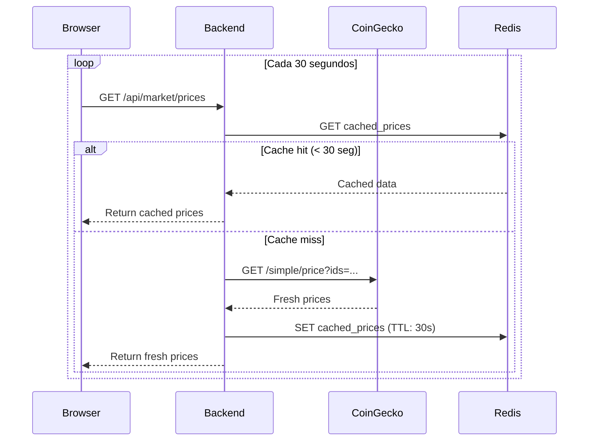
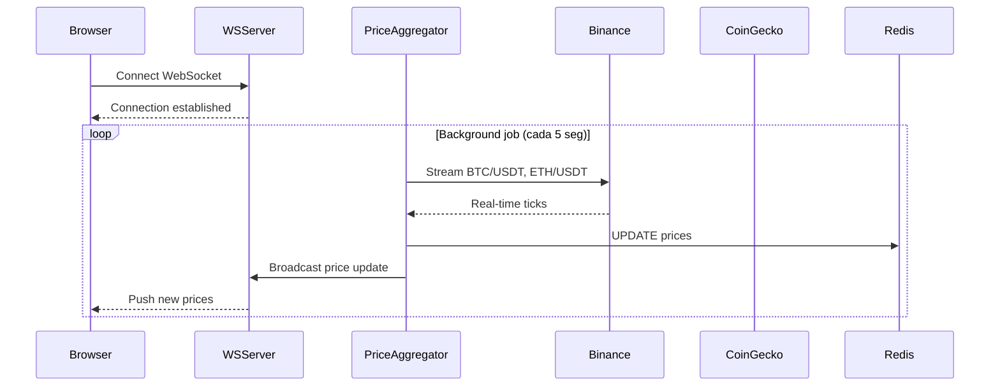
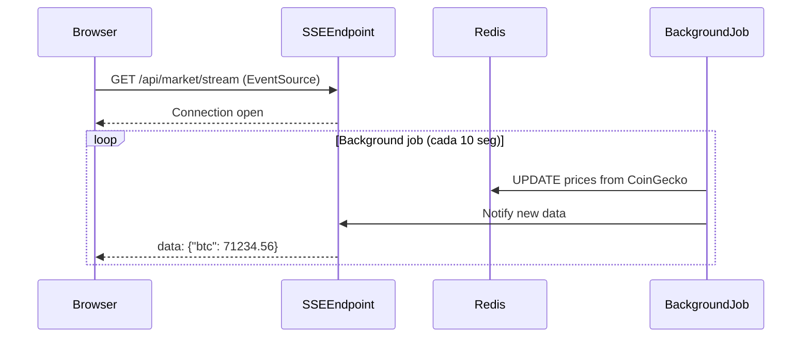

# Dashboard Público en Tiempo Real — Cripto & Acciones

> **Arquitectura completa para dashboard público con datos de mercado en tiempo real similar a CoinMarketCap y TradingView**
>
> Stack: React 18 · Next.js 14 · WebSockets · Redis · PostgreSQL · TanStack Query

---

## 📋 Tabla de Contenidos

- [1. Análisis de los dashboards de referencia](#1-análisis-de-los-dashboards-de-referencia)
- [2. Arquitectura de datos en tiempo real](#2-arquitectura-de-datos-en-tiempo-real)
- [3. Fuentes de datos gratuitas](#3-fuentes-de-datos-gratuitas)
- [4. Stack tecnológico recomendado](#4-stack-tecnológico-recomendado)
- [5. Componentes del dashboard](#5-componentes-del-dashboard)
- [6. WebSockets para tiempo real](#6-websockets-para-tiempo-real)
- [7. Optimización de rendimiento](#7-optimización-de-rendimiento)
- [8. Implementación completa](#8-implementación-completa)
- [9. Alternativas: SaaS vs Self-hosted](#9-alternativas-saas-vs-self-hosted)
- [10. Costos y escalabilidad](#10-costos-y-escalabilidad)

---

## 1. Análisis de los dashboards de referencia

### CoinMarketCap (Captura 1)

**Elementos observados:**

| Componente | Descripción | Actualización |
|------------|-------------|---------------|
| **Market Cap total** | `$2.43T ↑1.07%` | Cada 30-60 segundos |
| **Fear & Greed Index** | Gauge visual `32 (Fear)` | Cada 24 horas |
| **Altcoin Season Index** | `45/100` con slider | Cada hora |
| **Average Crypto RSI** | `52.82 (Oversold)` | Cada 5 minutos |
| **Tabla de criptomonedas** | Top 100 con precio, volume, market cap | Cada 10-30 segundos |
| **Mini charts (7 días)** | Sparklines por cada crypto | Estáticos (se actualizan al recargar) |

**Características clave:**
- ✅ Datos **casi en tiempo real** (10-30 seg delay)
- ✅ Pagination de tabla (lazy loading)
- ✅ Filtros por blockchain (BSC, Solana, Ethereum)
- ✅ Sorting por columnas (precio, volume, market cap)

---

### TradingView México (Captura 2)

**Elementos observados:**

| Componente | Descripción | Actualización |
|------------|-------------|---------------|
| **Ticker tape superior** | Scroll horizontal con precios | Cada 1-5 segundos |
| **Acciones ganadoras** | Top movers del día `+5.88%`, `+4.87%` | Cada 1 minuto |
| **Acciones perdedoras** | Worst performers `-4.94%`, `-3.82%` | Cada 1 minuto |
| **Badges de cambio %** | Pills verdes/rojas con porcentaje | Tiempo real |

**Características clave:**
- ✅ Datos en **tiempo real** (1-5 seg)
- ✅ Animaciones suaves en cambios de precio
- ✅ Color coding automático (verde = up, rojo = down)
- ✅ Filtros por categoría (ganadoras, perdedoras, volumen)

---

## 2. Arquitectura de datos en tiempo real

### Opción 1: Polling (Simple, limitado)



**Pros:**
- ✅ Simple de implementar
- ✅ No requiere infraestructura adicional
- ✅ Compatible con cualquier hosting (Vercel, Netlify)

**Contras:**
- ❌ No es tiempo real (delay de 30-60 seg)
- ❌ Alto consumo de requests (muchos clientes polling)
- ❌ No escala bien con >1000 usuarios concurrentes

---

### Opción 2: WebSockets (Recomendado, tiempo real)



**Pros:**
- ✅ Tiempo real verdadero (1-5 seg delay)
- ✅ Eficiente (1 conexión por cliente)
- ✅ Escala bien con Socket.IO clustering

**Contras:**
- ❌ Requiere servidor Node.js (no funciona en Vercel/Netlify serverless)
- ❌ Mayor complejidad de infraestructura

---

### Opción 3: Server-Sent Events (SSE) — Híbrido



**Pros:**
- ✅ Más simple que WebSockets
- ✅ Funciona con serverless + Redis Pub/Sub
- ✅ Suficiente para dashboards públicos (no bidereccional)

**Contras:**
- ❌ Solo server-to-client (no client-to-server)
- ❌ Menos eficiente que WebSockets para alta frecuencia

---

## 3. Fuentes de datos gratuitas

### Criptomonedas

| API | Endpoints clave | Límite gratuito | Delay | Recomendación |
|-----|-----------------|-----------------|-------|---------------|
| **CoinGecko** | `/simple/price`, `/coins/markets` | 30 req/min | ~10 seg | ✅ **Mejor para dashboards públicos** |
| **CoinMarketCap** | `/v1/cryptocurrency/listings/latest` | 333 req/día | ~10 seg | ⚠️ Muy limitado para tiempo real |
| **Binance Public API** | WebSocket `/ws/!ticker@arr` | Ilimitado | Tiempo real | ✅ **Mejor para precios en tiempo real** |
| **Kraken** | `/Ticker` | Ilimitado | Tiempo real | ✅ Alternativa a Binance |
| **CryptoCompare** | `/pricemulti` | 100k req/mes | ~5 seg | ⚠️ Limitado |

---

### Acciones (Stocks)

| API | Endpoints clave | Límite gratuito | Delay | Recomendación |
|-----|-----------------|-----------------|-------|---------------|
| **Alpha Vantage** | `/TIME_SERIES_INTRADAY` | 25 req/día | 15 min delay | ❌ Muy limitado |
| **Finnhub** | `/quote`, `/stock/candle` | 60 req/min | Tiempo real | ✅ **Mejor gratuita** |
| **Polygon.io** | `/v2/aggs/ticker` | 5 req/min | 15 min delay | ⚠️ Tier gratuito muy limitado |
| **Yahoo Finance** | Scraping (no oficial) | Ilimitado | Tiempo real | ⚠️ No garantizado (usar con proxy) |
| **IEX Cloud** | `/stock/{symbol}/quote` | 50k msg/mes | Tiempo real | ✅ Buena opción gratuita |

**Nota importante:** Datos de acciones en **tiempo real** requieren licencias pagadas (NYSE, NASDAQ). Las APIs gratuitas tienen delay de 15 minutos.

---

### Índices de mercado (Fear & Greed, RSI, etc.)

| Métrica | API | Actualización | Gratuito |
|---------|-----|---------------|----------|
| **Fear & Greed Index** | Alternative.me `/fng/` | 24 horas | ✅ Sí |
| **RSI (Relative Strength Index)** | Calcular manualmente con OHLCV data | Tiempo real | ✅ Sí (si tienes OHLCV) |
| **Altcoin Season Index** | Calcular con dominancia BTC | 1 hora | ✅ Sí |
| **Market Cap total** | CoinGecko `/global` | 5-10 min | ✅ Sí |

---

## 4. Stack tecnológico recomendado

### Arquitectura completa

```
┌─────────────────────────────────────────────────────────────┐
│                    FRONTEND (Next.js 14)                    │
│  ┌─────────────┐  ┌──────────────┐  ┌──────────────────┐  │
│  │ Dashboard   │  │ TanStack     │  │ WebSocket        │  │
│  │ Components  │──│ Query        │──│ Client           │  │
│  └─────────────┘  └──────────────┘  └──────────────────┘  │
└─────────────────────────────────────────────────────────────┘
                              │
                              ↓ (WebSocket / SSE)
┌─────────────────────────────────────────────────────────────┐
│                   BACKEND (Node.js + Socket.IO)             │
│  ┌─────────────┐  ┌──────────────┐  ┌──────────────────┐  │
│  │ WebSocket   │  │ Price        │  │ Redis            │  │
│  │ Server      │──│ Aggregator   │──│ Pub/Sub          │  │
│  └─────────────┘  └──────────────┘  └──────────────────┘  │
└─────────────────────────────────────────────────────────────┘
                              │
                              ↓ (Background Jobs)
┌─────────────────────────────────────────────────────────────┐
│                    EXTERNAL APIs                            │
│  ┌─────────────┐  ┌──────────────┐  ┌──────────────────┐  │
│  │ CoinGecko   │  │ Binance WS   │  │ Finnhub          │  │
│  └─────────────┘  └──────────────┘  └──────────────────┘  │
└─────────────────────────────────────────────────────────────┘
```

---

### Stack detallado

**Frontend:**
- **Framework**: Next.js 14 (App Router) — SSR + Static Generation
- **UI**: TailwindCSS + shadcn/ui
- **Estado global**: Zustand (para precios en tiempo real)
- **Data fetching**: TanStack Query (React Query v5)
- **WebSocket**: Socket.IO client
- **Charts**: Recharts o Lightweight Charts (TradingView)

**Backend:**
- **Runtime**: Node.js 20 + TypeScript
- **WebSocket**: Socket.IO
- **Jobs**: BullMQ (para background jobs)
- **Cache**: Redis 7
- **API REST**: Express.js
- **ORM**: Prisma (si necesitas persistencia)

**Infraestructura:**
- **Hosting**: Railway / Render / DigitalOcean (WebSockets no funcionan en Vercel)
- **Database**: PostgreSQL (para históricos)
- **Cache**: Redis (Upstash o self-hosted)
- **CDN**: Cloudflare (para assets estáticos)

---

## 5. Componentes del dashboard

### Componente 1: Market Overview Cards

```tsx
// components/MarketOverview.tsx
import { useQuery } from '@tanstack/react-query';

interface MarketData {
  totalMarketCap: number;
  totalMarketCapChange24h: number;
  fearGreedIndex: number;
  altcoinSeasonIndex: number;
  avgCryptoRSI: number;
}

export function MarketOverview() {
  const { data, isLoading } = useQuery({
    queryKey: ['market-overview'],
    queryFn: fetchMarketOverview,
    refetchInterval: 30000, // Cada 30 segundos
  });

  if (isLoading) return <LoadingSkeleton />;

  return (
    <div className="grid grid-cols-1 md:grid-cols-4 gap-4">
      {/* Market Cap */}
      <Card>
        <CardTitle>Market Cap</CardTitle>
        <div className="text-3xl font-bold">
          ${formatNumber(data.totalMarketCap)}
        </div>
        <div className={data.totalMarketCapChange24h > 0 ? 'text-green-500' : 'text-red-500'}>
          {data.totalMarketCapChange24h > 0 ? '↑' : '↓'} 
          {Math.abs(data.totalMarketCapChange24h).toFixed(2)}%
        </div>
      </Card>

      {/* Fear & Greed */}
      <Card>
        <CardTitle>Fear & Greed</CardTitle>
        <FearGreedGauge value={data.fearGreedIndex} />
      </Card>

      {/* Altcoin Season */}
      <Card>
        <CardTitle>Altcoin Season</CardTitle>
        <SeasonSlider value={data.altcoinSeasonIndex} max={100} />
      </Card>

      {/* Average RSI */}
      <Card>
        <CardTitle>Average Crypto RSI</CardTitle>
        <div className="text-3xl font-bold">{data.avgCryptoRSI.toFixed(2)}</div>
        <div className="text-sm text-gray-500">
          {data.avgCryptoRSI < 30 ? 'Oversold' : 
           data.avgCryptoRSI > 70 ? 'Overbought' : 'Neutral'}
        </div>
      </Card>
    </div>
  );
}
```

---

### Componente 2: Crypto Table con actualización en tiempo real

```tsx
// components/CryptoTable.tsx
import { useEffect, useState } from 'react';
import { useSocket } from '@/hooks/useSocket';

interface Crypto {
  id: string;
  symbol: string;
  name: string;
  price: number;
  priceChange24h: number;
  volume24h: number;
  marketCap: number;
  sparkline7d: number[];
}

export function CryptoTable() {
  const [cryptos, setCryptos] = useState<Crypto[]>([]);
  const socket = useSocket();

  useEffect(() => {
    // Initial load
    fetchCryptos().then(setCryptos);

    // Listen for real-time updates
    socket?.on('price-update', (update: { id: string; price: number; priceChange24h: number }) => {
      setCryptos(prev => 
        prev.map(crypto => 
          crypto.id === update.id 
            ? { ...crypto, price: update.price, priceChange24h: update.priceChange24h }
            : crypto
        )
      );
    });

    return () => {
      socket?.off('price-update');
    };
  }, [socket]);

  return (
    <table className="w-full">
      <thead>
        <tr>
          <th>#</th>
          <th>Name</th>
          <th>Price</th>
          <th>1h %</th>
          <th>24h %</th>
          <th>7d %</th>
          <th>Market Cap</th>
          <th>Volume(24h)</th>
          <th>Last 7 Days</th>
        </tr>
      </thead>
      <tbody>
        {cryptos.map((crypto, index) => (
          <tr key={crypto.id}>
            <td>{index + 1}</td>
            <td>
              <div className="flex items-center gap-2">
                
                <span>{crypto.name}</span>
                <span className="text-gray-500">{crypto.symbol.toUpperCase()}</span>
              </div>
            </td>
            <td className="font-mono">${crypto.price.toLocaleString()}</td>
            <td className={crypto.priceChange24h > 0 ? 'text-green-500' : 'text-red-500'}>
              {crypto.priceChange24h > 0 ? '▲' : '▼'} {Math.abs(crypto.priceChange24h).toFixed(2)}%
            </td>
            {/* ... resto de columnas */}
            <td>
              <MiniChart data={crypto.sparkline7d} />
            </td>
          </tr>
        ))}
      </tbody>
    </table>
  );
}
```

---

### Componente 3: Ticker Tape (scroll horizontal)

```tsx
// components/TickerTape.tsx
import { useSocket } from '@/hooks/useSocket';
import { useEffect, useState } from 'react';

interface Ticker {
  symbol: string;
  price: number;
  change24h: number;
}

export function TickerTape() {
  const [tickers, setTickers] = useState<Ticker[]>([]);
  const socket = useSocket();

  useEffect(() => {
    socket?.on('ticker-update', (data: Ticker[]) => {
      setTickers(data);
    });
  }, [socket]);

  return (
    <div className="overflow-hidden bg-gray-900 py-2">
      <div className="flex animate-scroll gap-8">
        {tickers.map((ticker, index) => (
          <div key={`${ticker.symbol}-${index}`} className="flex items-center gap-2 whitespace-nowrap">
            <span className="font-semibold text-white">{ticker.symbol}</span>
            <span className="text-gray-300">${ticker.price.toFixed(2)}</span>
            <span className={ticker.change24h > 0 ? 'text-green-400' : 'text-red-400'}>
              {ticker.change24h > 0 ? '+' : ''}{ticker.change24h.toFixed(2)}%
            </span>
          </div>
        ))}
        {/* Duplicar para scroll infinito */}
        {tickers.map((ticker, index) => (
          <div key={`${ticker.symbol}-dup-${index}`} className="flex items-center gap-2 whitespace-nowrap">
            <span className="font-semibold text-white">{ticker.symbol}</span>
            <span className="text-gray-300">${ticker.price.toFixed(2)}</span>
            <span className={ticker.change24h > 0 ? 'text-green-400' : 'text-red-400'}>
              {ticker.change24h > 0 ? '+' : ''}{ticker.change24h.toFixed(2)}%
            </span>
          </div>
        ))}
      </div>
    </div>
  );
}

// Tailwind CSS animation
// tailwind.config.js
module.exports = {
  theme: {
    extend: {
      animation: {
        scroll: 'scroll 60s linear infinite',
      },
      keyframes: {
        scroll: {
          '0%': { transform: 'translateX(0)' },
          '100%': { transform: 'translateX(-50%)' },
        },
      },
    },
  },
};
```

---

## 6. WebSockets para tiempo real

### Backend: Socket.IO Server

```typescript
// server/websocket.ts
import { Server } from 'socket.io';
import { Redis } from 'ioredis';

const redis = new Redis(process.env.REDIS_URL);

export function setupWebSocket(server: any) {
  const io = new Server(server, {
    cors: {
      origin: process.env.FRONTEND_URL,
      methods: ['GET', 'POST'],
    },
  });

  io.on('connection', (socket) => {
    console.log('Client connected:', socket.id);

    // Subscribe to Redis pub/sub for price updates
    const subscriber = redis.duplicate();
    subscriber.subscribe('price-updates');

    subscriber.on('message', (channel, message) => {
      if (channel === 'price-updates') {
        const data = JSON.parse(message);
        socket.emit('price-update', data);
      }
    });

    socket.on('disconnect', () => {
      console.log('Client disconnected:', socket.id);
      subscriber.unsubscribe('price-updates');
      subscriber.quit();
    });
  });

  return io;
}
```

---

### Background Job: Price Aggregator

```typescript
// jobs/priceAggregator.ts
import { Queue, Worker } from 'bullmq';
import { Redis } from 'ioredis';
import WebSocket from 'ws';

const redis = new Redis(process.env.REDIS_URL);

// Job que se ejecuta cada 10 segundos
const priceQueue = new Queue('price-updates', { connection: redis });

// Worker que escucha Binance WebSocket y actualiza precios
const worker = new Worker('price-updates', async (job) => {
  const ws = new WebSocket('wss://stream.binance.com:9443/ws/!ticker@arr');

  ws.on('message', (data) => {
    const tickers = JSON.parse(data.toString());
    
    // Filtrar solo los que nos interesan
    const relevantTickers = tickers
      .filter((t: any) => ['BTCUSDT', 'ETHUSDT', 'BNBUSDT'].includes(t.s))
      .map((t: any) => ({
        symbol: t.s,
        price: parseFloat(t.c),
        priceChange24h: parseFloat(t.P),
        volume24h: parseFloat(t.v),
      }));

    // Publicar en Redis Pub/Sub
    redis.publish('price-updates', JSON.stringify(relevantTickers));
  });

  ws.on('error', (error) => {
    console.error('Binance WebSocket error:', error);
  });
}, { connection: redis });

// Agregar job recurrente
await priceQueue.add(
  'fetch-prices',
  {},
  { repeat: { every: 10000 } } // Cada 10 segundos
);
```

---

### Frontend: useSocket Hook

```typescript
// hooks/useSocket.ts
import { useEffect, useState } from 'react';
import { io, Socket } from 'socket.io-client';

export function useSocket() {
  const [socket, setSocket] = useState<Socket | null>(null);

  useEffect(() => {
    const socketInstance = io(process.env.NEXT_PUBLIC_WS_URL || 'http://localhost:3001', {
      transports: ['websocket'],
      reconnection: true,
      reconnectionAttempts: 5,
      reconnectionDelay: 1000,
    });

    socketInstance.on('connect', () => {
      console.log('WebSocket connected');
    });

    socketInstance.on('disconnect', () => {
      console.log('WebSocket disconnected');
    });

    setSocket(socketInstance);

    return () => {
      socketInstance.disconnect();
    };
  }, []);

  return socket;
}
```

---

## 7. Optimización de rendimiento

### 1. Virtual scrolling para tablas grandes

```tsx
// components/VirtualizedCryptoTable.tsx
import { useVirtualizer } from '@tanstack/react-virtual';
import { useRef } from 'react';

export function VirtualizedCryptoTable({ data }: { data: Crypto[] }) {
  const parentRef = useRef<HTMLDivElement>(null);

  const virtualizer = useVirtualizer({
    count: data.length,
    getScrollElement: () => parentRef.current,
    estimateSize: () => 60, // Altura estimada de cada fila
    overscan: 10, // Renderizar 10 filas extra fuera del viewport
  });

  return (
    <div ref={parentRef} className="h-[600px] overflow-auto">
      <div
        style={{
          height: `${virtualizer.getTotalSize()}px`,
          width: '100%',
          position: 'relative',
        }}
      >
        {virtualizer.getVirtualItems().map((virtualRow) => {
          const crypto = data[virtualRow.index];
          return (
            <div
              key={virtualRow.index}
              style={{
                position: 'absolute',
                top: 0,
                left: 0,
                width: '100%',
                height: `${virtualRow.size}px`,
                transform: `translateY(${virtualRow.start}px)`,
              }}
            >
              <CryptoRow crypto={crypto} />
            </div>
          );
        })}
      </div>
    </div>
  );
}
```

---

### 2. Debounce de actualizaciones

```typescript
// utils/debounce.ts
import { useEffect, useRef, useState } from 'react';

export function useDebouncedPriceUpdates(rawPrices: Crypto[], delay = 500) {
  const [debouncedPrices, setDebouncedPrices] = useState(rawPrices);
  const timerRef = useRef<NodeJS.Timeout>();

  useEffect(() => {
    if (timerRef.current) {
      clearTimeout(timerRef.current);
    }

    timerRef.current = setTimeout(() => {
      setDebouncedPrices(rawPrices);
    }, delay);

    return () => {
      if (timerRef.current) {
        clearTimeout(timerRef.current);
      }
    };
  }, [rawPrices, delay]);

  return debouncedPrices;
}
```

---

### 3. Memoización de componentes

```tsx
import { memo } from 'react';

export const CryptoRow = memo(({ crypto }: { crypto: Crypto }) => {
  return (
    <tr>
      <td>{crypto.name}</td>
      <td>${crypto.price.toFixed(2)}</td>
      {/* ... */}
    </tr>
  );
}, (prevProps, nextProps) => {
  // Solo re-renderizar si el precio cambió
  return prevProps.crypto.price === nextProps.crypto.price;
});
```

---

## 8. Implementación completa

### Paso 1: Setup del proyecto

```bash
# Frontend (Next.js)
npx create-next-app@latest dashboard --typescript --tailwind --app
cd dashboard
npm install @tanstack/react-query zustand socket.io-client recharts

# Backend (Node.js + Socket.IO)
mkdir backend && cd backend
npm init -y
npm install express socket.io ioredis bullmq ws cors dotenv
npm install -D @types/node @types/express typescript ts-node
```

---

### Paso 2: Variables de entorno

```bash
# .env (Frontend)
NEXT_PUBLIC_WS_URL=http://localhost:3001
NEXT_PUBLIC_API_URL=http://localhost:3001/api

# .env (Backend)
PORT=3001
REDIS_URL=redis://localhost:6379
FRONTEND_URL=http://localhost:3000
```

---

### Paso 3: Desplegar en Railway

```yaml
# railway.toml
[build]
builder = "NIXPACKS"

[deploy]
startCommand = "npm run start"
restartPolicyType = "ON_FAILURE"
restartPolicyMaxRetries = 10

[[services]]
name = "backend"
port = 3001

[[services]]
name = "redis"
port = 6379
```

---

## 9. Alternativas: SaaS vs Self-hosted

### Opción A: Self-hosted (Recomendado para control total)

**Stack:** Next.js + Socket.IO + Redis + PostgreSQL

**Pros:**
- ✅ Control total de datos
- ✅ Sin límites de requests
- ✅ Personalizable al 100%

**Contras:**
- ❌ Requiere mantenimiento
- ❌ Costos de hosting (~$30-50/mes)

**Hosting:** Railway, Render, DigitalOcean, Fly.io

---

### Opción B: SaaS (Plug & Play, pero limitado)

| Servicio | Características | Precio | Límites |
|----------|----------------|--------|---------|
| **TradingView Widgets** | Embeds listos para usar | Gratis | Solo visual, no datos raw |
| **CoinMarketCap Widget** | Tabla de cryptos lista | Gratis | No personalizable |
| **Finnhub Widgets** | Charts y quotes de stocks | Gratis | Solo visual |

**Uso:** Ideales para MVPs o blogs, pero NO para dashboards personalizados.

---

## 10. Costos y escalabilidad

### Costos mensuales estimados

| Componente | Proveedor | Costo/mes |
|------------|-----------|-----------|
| **Frontend** | Vercel (Hobby) | $0 |
| **Backend + WebSocket** | Railway (Starter) | $20 |
| **Redis** | Upstash (Pay as you go) | $10 |
| **PostgreSQL** | Railway (incluido) | $0 |
| **Total** | | **$30/mes** |

**Escalabilidad:**
- 1,000 usuarios concurrentes: $30/mes
- 10,000 usuarios concurrentes: $100-150/mes (upgrade a Railway Pro)
- 100,000 usuarios concurrentes: $500-1000/mes (múltiples instancias + load balancer)

---

## 📚 Referencias

- [CoinGecko API Docs](https://www.coingecko.com/en/api/documentation)
- [Binance WebSocket Streams](https://binance-docs.github.io/apidocs/spot/en/#websocket-market-streams)
- [Finnhub API](https://finnhub.io/docs/api)
- [Socket.IO Documentation](https://socket.io/docs/v4/)
- [TanStack Query](https://tanstack.com/query/latest)
- [TanStack Virtual](https://tanstack.com/virtual/latest)

---

## 📄 Licencia

Documentación técnica — Portfolio Tracker  
Stack: Next.js 14 · Socket.IO · Redis · TanStack Query  
Versión: 1.0 · Marzo 2026
